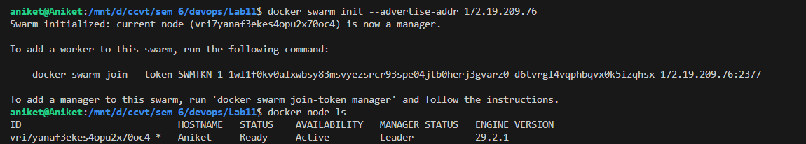
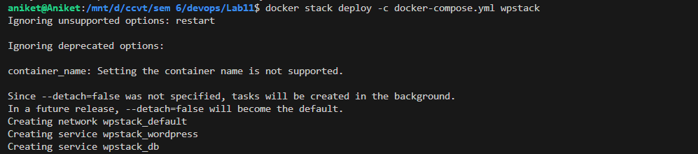
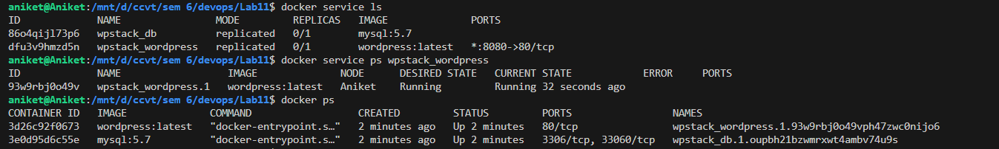
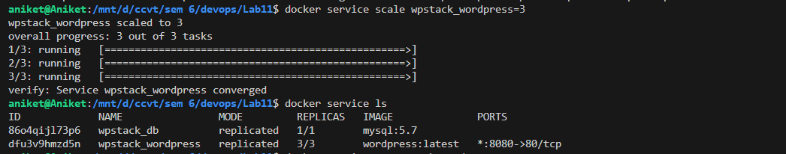
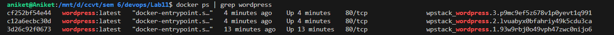
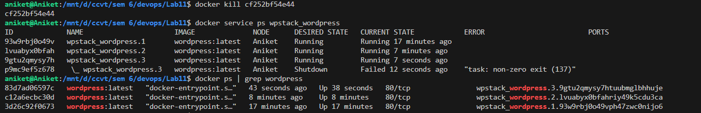
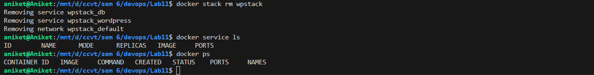

# Lab Experiment 11 
# Container Orchestration using Docker Compose & Docker Swarm

## Aim

To understand and implement container orchestration using Docker Compose and Docker Swarm by deploying a multi-container WordPress + MySQL application, scaling it, and observing self-healing capabilities.

---

## Theory

### 1 What is Container Orchestration?

Container orchestration is the **automated management of containerized applications** across multiple hosts. As applications grow in complexity, manually managing individual containers becomes impractical. Orchestration tools handle:

- **Scheduling** – deciding where and how containers run
- **Scaling** – increasing or decreasing the number of container instances
- **Self-healing** – automatically restarting or replacing failed containers
- **Load balancing** – distributing incoming traffic evenly across containers
- **Service discovery** – allowing containers to find and communicate with each other

A useful analogy is a **restaurant manager**: they decide how many waiters are needed, immediately replace a sick waiter, and distribute customers evenly across tables — all automatically.

---

### 2 Evolution of Container Management

```
docker run  →  Docker Compose  →  Docker Swarm  →  Kubernetes
    │               │                  │                │
Single          Multi-container     Orchestration    Advanced
container       (single host)       (basic)          orchestration
```

| Tool | What it does | Limitation |
|------|-------------|------------|
| `docker run` | Runs a single container | Manual, no coordination |
| Docker Compose | Runs multiple containers together | Single machine, no auto-healing |
| Docker Swarm | Orchestrates containers across nodes | Less feature-rich than Kubernetes |
| Kubernetes | Advanced orchestration at scale | High complexity |

---

### 3 Docker Compose

Docker Compose is a tool for defining and running **multi-container Docker applications** using a YAML configuration file (`docker-compose.yml`). It is primarily used for:

- **Development and testing environments**
- Defining service dependencies (e.g., WordPress depends on MySQL)
- Simple port mapping, volume management, and environment variables

**Limitations of Docker Compose:**
- Works on a **single host only** — no multi-node support
- Scaling causes **port conflicts** (multiple containers cannot bind the same host port)
- No **self-healing** — failed containers must be restarted manually
- No built-in **load balancing**

---

### 4 Docker Swarm

Docker Swarm is Docker's **native clustering and orchestration solution**. It groups multiple Docker hosts into a single virtual host called a **swarm**, enabling production-grade container management.

**Key Concepts:**

| Concept | Description |
|---------|-------------|
| **Swarm** | A cluster of Docker nodes (machines) |
| **Manager Node** | Controls the cluster, schedules tasks, manages state |
| **Worker Node** | Executes tasks assigned by the manager |
| **Service** | A definition of how to run containers (image, replicas, ports) |
| **Task** | A single running container instance within a service |
| **Stack** | A group of services deployed together using a Compose file |
| **Replica** | A copy of a service container running in the swarm |

**Features of Docker Swarm:**

- **Scaling:** `docker service scale` adjusts replicas with one command
- **Self-Healing:** Swarm detects failed containers and automatically recreates them to maintain the desired replica count
- **Load Balancing:** An internal load balancer (routing mesh) distributes traffic across all replicas — a single published port handles all instances
- **Rolling Updates:** Services can be updated with zero downtime
- **Service Discovery:** Uses internal DNS and Virtual IPs (VIP) for container-to-container communication
- **Multi-host:** Containers can be distributed across multiple machines seamlessly

---

### 5 Docker Compose vs Docker Swarm — Comparison

| Feature | Docker Compose | Docker Swarm |
|---------|---------------|-------------|
| Scope | Single host only | Multi-node cluster |
| Scaling | `--scale` flag (limited) | `docker service scale` (built-in) |
| Load Balancing | Basic / none | Built-in routing mesh |
| Self-Healing | No |  Yes (automatic) |
| Rolling Updates | No | Yes (zero downtime) |
| Service Discovery | Via container names | Via DNS + VIP |
| Use Case | Development, testing | Simple production clusters |

---

### 6 The Port Mystery — How Swarm Handles Scaling

In plain Docker Compose, scaling WordPress to 3 instances **fails** because all three containers try to bind to port `8080` on the host — causing port conflicts.

In Docker Swarm, this is solved by the **routing mesh (ingress network)**:

```
Internet
    │
    ▼
Port 8080 (Swarm Ingress Load Balancer — listens ONCE)
    │
    ├──► WordPress Container 1
    ├──► WordPress Container 2
    └──► WordPress Container 3
```

- The Swarm load balancer listens on port `8080` **once**
- Traffic is distributed internally to all replicas
- No port conflicts — all containers run on internal ports

---

## Prerequisites

- Docker installed with Swarm mode available
- `docker-compose.yml` from Experiment 6 (WordPress + MySQL setup)

---

## Docker Compose File Used

```yaml
# docker-compose.yml (from Experiment 6)
version: '3.9'
services:
  db:
    image: mysql:5.7
    container_name: wordpress_db
    restart: always
    environment:
      MYSQL_ROOT_PASSWORD: rootpass
      MYSQL_DATABASE: wordpress
      MYSQL_USER: wpuser
      MYSQL_PASSWORD: wppass
    volumes:
      - db_data:/var/lib/mysql

  wordpress:
    image: wordpress:latest
    container_name: wordpress_app
    depends_on:
      - db
    ports:
      - "8080:80"
    restart: always
    environment:
      WORDPRESS_DB_HOST: db:3306
      WORDPRESS_DB_USER: wpuser
      WORDPRESS_DB_PASSWORD: wppass
      WORDPRESS_DB_NAME: wordpress
    volumes:
      - wp_data:/var/www/html

volumes:
  db_data:
  wp_data:
```

---

## Procedure & Output

### Task 1: Initialize Docker Swarm

**Command:**
```bash
docker swarm init --advertise-addr 172.19.209.76
```

**Output:**
```
Swarm initialized: current node (vri7yanaf3ekes4opu2x70oc4) is now a manager.

To add a worker to this swarm, run the following command:

    docker swarm join --token SWMTKN-1-1wl1f0kv0alxwbsy83msvyezsrcr93spe04jtb0herj3gvarz0-d6tvrgl4vqphbqvx0k5izqhsx 172.19.209.76:2377
```

**Verify Swarm is active:**
```bash
docker node ls
```

**Output:**
```
ID                            HOSTNAME   STATUS    AVAILABILITY   MANAGER STATUS   ENGINE VERSION
vri7yanaf3ekes4opu2x70oc4 *   Aniket     Ready     Active         Leader           29.2.1
```


---

### Task 2: Deploy as a Stack

**Command:**
```bash
docker stack deploy -c docker-compose.yml wpstack
```

**Output:**
```
Ignoring unsupported options: restart
Ignoring deprecated options:
container_name: Setting the container name is not supported.
Creating network wpstack_default
Creating service wpstack_wordpress
Creating service wpstack_db
```

**Explanation:** Swarm reads the Compose file and creates **services** (not direct containers). Services are named `<stack_name>_<service_name>` (e.g., `wpstack_wordpress`). A default overlay network `wpstack_default` is also created.



---

### Task 3: Verify the Deployment

**Command:**
```bash
docker service ls
```

**Output:**
```
ID             NAME                MODE         REPLICAS   IMAGE              PORTS
86o4qijl73p6   wpstack_db          replicated   0/1        mysql:5.7          
dfu3v9hmzd5n   wpstack_wordpress   replicated   0/1        wordpress:latest   *:8080->80/tcp
```

**Check individual service tasks:**
```bash
docker service ps wpstack_wordpress
```

**Output:**
```
ID             NAME                  IMAGE              NODE      DESIRED STATE   CURRENT STATE            ERROR     PORTS
93w9rbj0o49v   wpstack_wordpress.1   wordpress:latest   Aniket    Running         Running 32 seconds ago             
```

**Running containers:**
```bash
docker ps
```

**Output:**
```
CONTAINER ID   IMAGE              COMMAND                  CREATED         STATUS         PORTS                 NAMES
3d26c92f0673   wordpress:latest   "docker-entrypoint.s…"   2 minutes ago   Up 2 minutes   80/tcp                wpstack_wordpress.1.93w9rbj0o49vph47zwc0nijo6
3e0d95d6c55e   mysql:5.7          "docker-entrypoint.s…"   2 minutes ago   Up 2 minutes   3306/tcp, 33060/tcp   wpstack_db.1.oupbh21bzwmrxwt4ambv74u9s
```

**Explanation:** Containers are now managed by Swarm with structured names: `<stack>_<service>.<replica_number>.<task_id>`. The application is accessible at `http://localhost:8080`.




---
### Task 4: Scale the Application

**Command:**
```bash
docker service scale wpstack_wordpress=3
```

**Output:**
```
wpstack_wordpress scaled to 3
overall progress: 3 out of 3 tasks 
1/3: running   [==================================================>] 
2/3: running   [==================================================>] 
3/3: running   [==================================================>] 
verify: Service wpstack_wordpress converged 
```

**Verify scaling:**
```bash
docker service ls
```

**Output:**
```
ID             NAME                MODE         REPLICAS   IMAGE              PORTS
86o4qijl73p6   wpstack_db          replicated   1/1        mysql:5.7          
dfu3v9hmzd5n   wpstack_wordpress   replicated   3/3        wordpress:latest   *:8080->80/tcp
```



**Check all 3 WordPress containers:**
```bash
docker ps | grep wordpress
```

**Output:**
```
cf252bf54e44   wordpress:latest   "docker-entrypoint.s…"   4 minutes ago    Up 4 minutes    80/tcp   wpstack_wordpress.3.p9mc9ef5z678...
c12a6ecbc30d   wordpress:latest   "docker-entrypoint.s…"   4 minutes ago    Up 4 minutes    80/tcp   wpstack_wordpress.2.lvuabyx0bfah...
3d26c92f0673   wordpress:latest   "docker-entrypoint.s…"   13 minutes ago   Up 13 minutes   80/tcp   wpstack_wordpress.1.93w9rbj0o49v...
```

**Explanation:** With a single command, WordPress scaled from 1 to 3 replicas. The Swarm load balancer distributes all incoming traffic on port `8080` across all 3 containers automatically.


---

### Task 5: Test Self-Healing

**Step 1 — Kill one container (simulate crash):**
```bash
docker kill cf252bf54e44
```

**Step 2 — Watch Swarm recover:**
```bash
docker service ps wpstack_wordpress
```

**Output:**
```
ID             NAME                      IMAGE              NODE      DESIRED STATE   CURRENT STATE            ERROR                         PORTS
93w9rbj0o49v   wpstack_wordpress.1       wordpress:latest   Aniket    Running         Running 17 minutes ago                                 
lvuabyx0bfah   wpstack_wordpress.2       wordpress:latest   Aniket    Running         Running 7 minutes ago                                  
9gtu2qmysy7h   wpstack_wordpress.3       wordpress:latest   Aniket    Running         Running 7 seconds ago                                  
p9mc9ef5z678    \_ wpstack_wordpress.3   wordpress:latest   Aniket    Shutdown        Failed 12 seconds ago    "task: non-zero exit (137)"   
```

**Step 3 — Verify new container is running:**
```bash
docker ps | grep wordpress
```

**Output:**
```
83d7ad06597c   wordpress:latest   "docker-entrypoint.s…"   43 seconds ago   Up 38 seconds   80/tcp   wpstack_wordpress.3.9gtu2qmysy7h...
c12a6ecbc30d   wordpress:latest   "docker-entrypoint.s…"   8 minutes ago    Up 8 minutes    80/tcp   wpstack_wordpress.2.lvuabyx0bfah...
3d26c92f0673   wordpress:latest   "docker-entrypoint.s…"   17 minutes ago   Up 17 minutes   80/tcp   wpstack_wordpress.1.93w9rbj0o49v...
```

**Explanation:** When container `wpstack_wordpress.3` was killed (exit code 137 = SIGKILL), Swarm immediately detected the failure and automatically spawned a **new replacement container**. The replica count remained at 3 without any manual intervention — this is **self-healing**.


---

### Task 6: Remove the Stack

**Command:**
```bash
docker stack rm wpstack
```

**Output:**
```
Removing service wpstack_db
Removing service wpstack_wordpress
Removing network wpstack_default
```

**Verify cleanup:**
```bash
docker service ls
# (Empty — no services)

docker ps
# (Empty — no containers)
```


---

## Key Observations

### Observation 1: Compose File Reuse
The **same `docker-compose.yml`** file works for both plain Compose (`docker compose up`) and Swarm (`docker stack deploy`). Swarm *extends* Compose — it does not replace it.

### Observation 2: Containers vs Services
| Context | Command | Concept |
|---------|---------|---------|
| Docker Compose | `docker compose up -d` | Manages individual **containers** |
| Docker Swarm | `docker stack deploy` | Manages **services** (which manage containers) |

In Swarm, you interact with **services**, and Swarm manages the underlying containers automatically.

### Observation 3: Self-Healing Confirmed
When `docker kill` was used to forcefully stop `wpstack_wordpress.3`, Swarm detected the non-zero exit code (`137`) and launched a fresh replacement container within seconds — maintaining the desired state of 3 replicas.

---

## Answers to Lab Questions

**Q1. Why is Compose not enough for production?**
Docker Compose runs on a single host, has no self-healing (failed containers stay down), cannot distribute containers across multiple machines, and causes port conflicts when scaling. Production needs reliability, redundancy, and multi-host support — which Swarm provides.

**Q2. What does `docker stack deploy` do differently than `docker compose up`?**
`docker stack deploy` deploys services to a Swarm cluster, enabling scaling, load balancing, and self-healing. `docker compose up` simply starts containers on a single host with no orchestration.

**Q3. How does Swarm achieve self-healing?**
Swarm continuously monitors the actual state of running tasks against the desired state (defined replica count). If a container fails, Swarm detects the discrepancy and automatically schedules a new task (container) to restore the desired state.

**Q4. What happens if you run `docker kill` on a container managed by Swarm?**
Swarm detects the failure (non-zero exit code), marks the old task as `Shutdown/Failed`, and immediately creates a new replacement container to maintain the desired number of replicas.

**Q5. Can you use the same Compose file for both Compose and Swarm?**
Yes. The same `docker-compose.yml` works for both. Swarm ignores some Compose-only options (like `container_name` and `restart`) and adds orchestration on top. This makes the transition from development (Compose) to production (Swarm) seamless.

---

