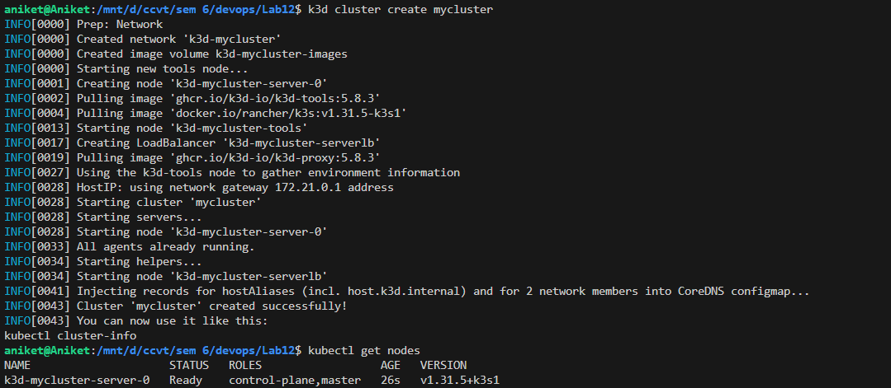
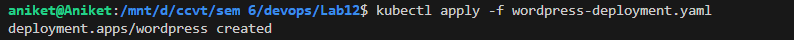
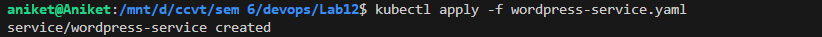
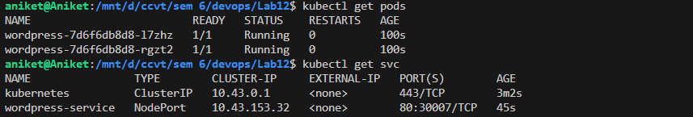
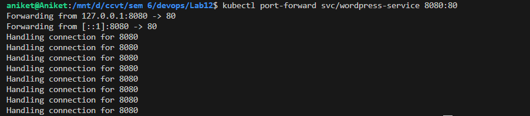
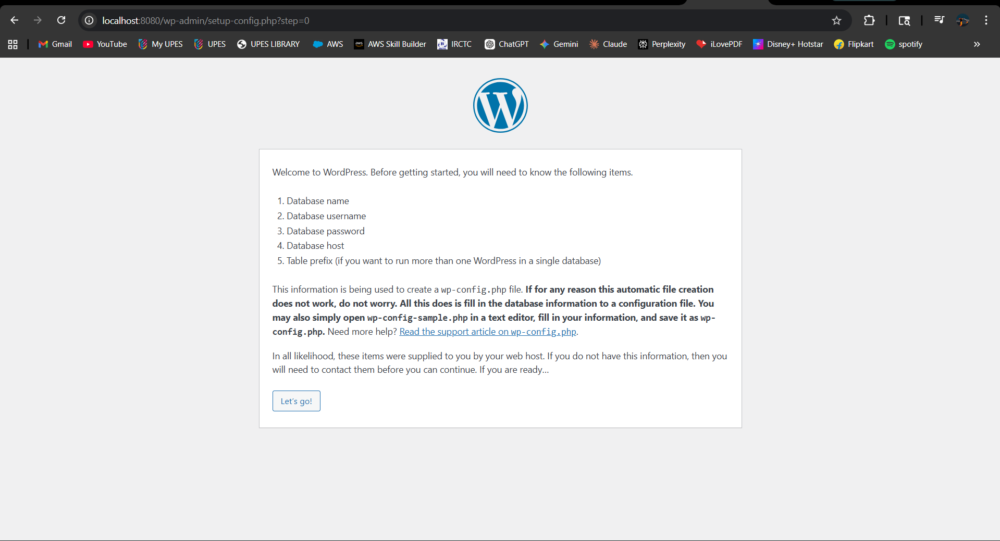
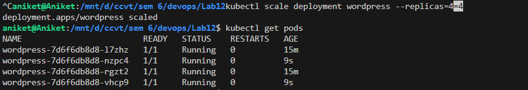
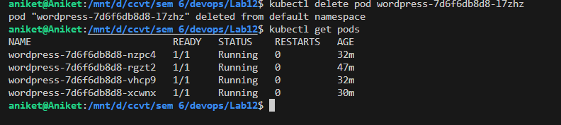

# Lab Experiment 12
# Study and Analyse Container Orchestration using Kubernetes

## 1. Aim

To study and analyse container orchestration using Kubernetes by deploying a WordPress application on a k3d cluster, exposing it via a Service, scaling the deployment, and demonstrating self-healing capabilities using `kubectl`.

---

## 2. Theory

### 2.1 What is Kubernetes?

Kubernetes (also written as **K8s**) is an open-source container orchestration platform originally developed by Google and now maintained by the **Cloud Native Computing Foundation (CNCF)**. It automates the deployment, scaling, and management of containerized applications across clusters of machines.

Kubernetes solves the core challenges of running containers in production:
- What happens when a container crashes? (Self-healing)
- How do you handle increased traffic? (Auto-scaling)
- How do containers find each other? (Service discovery)
- How do you update apps without downtime? (Rolling updates)

---

### 2.2 Why Kubernetes over Docker Swarm?

| Reason | Explanation |
|--------|-------------|
| **Industry standard** | Most companies worldwide use Kubernetes |
| **Powerful scheduling** | Automatically decides where to run containers based on resource availability |
| **Large ecosystem** | Vast collection of tools, plugins, dashboards, and extensions |
| **Cloud-native support** | Works natively on AWS (EKS), Google Cloud (GKE), Azure (AKS), etc. |
| **Advanced scaling** | Supports Horizontal Pod Autoscaler (HPA) based on CPU/memory metrics |
| **Rich observability** | Built-in integration with monitoring tools like Prometheus and Grafana |

---

### 2.3 Kubernetes Architecture

Kubernetes follows a **master-worker (control plane + node)** architecture:

```
┌──────────────────────────────────────────────┐
│              Control Plane (Master)           │
│                                              │
│  ┌─────────────┐  ┌──────────┐  ┌────────┐  │
│  │ API Server  │  │Scheduler │  │  etcd  │  │
│  └─────────────┘  └──────────┘  └────────┘  │
│  ┌──────────────────────────────────────┐    │
│  │     Controller Manager               │    │
│  └──────────────────────────────────────┘    │
└──────────────────────────────────────────────┘
           │              │
    ┌──────┴──────┐  ┌────┴────────┐
    │  Worker Node│  │ Worker Node │
    │  ┌────────┐ │  │  ┌────────┐ │
    │  │  Pod   │ │  │  │  Pod   │ │
    │  │ ┌────┐ │ │  │  │ ┌────┐ │ │
    │  │ │ C  │ │ │  │  │ │ C  │ │ │
    │  │ └────┘ │ │  │  │ └────┘ │ │
    │  └────────┘ │  │  └────────┘ │
    │   kubelet   │  │   kubelet   │
    └─────────────┘  └─────────────┘
```

**Control Plane Components:**
- **API Server** — The entry point for all Kubernetes commands; exposes the REST API
- **Scheduler** — Decides which node a new pod should run on based on resource availability
- **Controller Manager** — Ensures the desired state matches the actual state (e.g., keeps replica count correct)
- **etcd** — A distributed key-value store that holds all cluster configuration and state

**Worker Node Components:**
- **kubelet** — An agent on each node that ensures containers in pods are running
- **kube-proxy** — Manages network routing and load balancing for services
- **Container Runtime** — The engine that runs containers (e.g., containerd, Docker)

---

### 2.4 Core Kubernetes Concepts

| Docker Concept | Kubernetes Equivalent | What it Means |
|---------------|----------------------|---------------|
| Container | **Pod** | A Pod is a group of one or more containers. It is the smallest deployable unit in Kubernetes. |
| Compose service | **Deployment** | Describes how your app should run — which image, how many replicas, update strategy |
| Load balancing | **Service** | Exposes your app to the outside world or other pods with a stable IP/DNS |
| Scaling | **ReplicaSet** | Ensures a specific number of pod copies are always running |

#### 2.4.1 Pod
A **Pod** is the smallest unit in Kubernetes. It wraps one or more containers that share:
- The same network namespace (same IP address)
- The same storage volumes
- The same lifecycle

Pods are **ephemeral** — they can be deleted and recreated at any time. You should never rely on a pod's IP address directly.

#### 2.4.2 Deployment
A **Deployment** is a higher-level abstraction that manages Pods. It allows you to:
- Declare the desired number of replicas
- Perform rolling updates (update containers without downtime)
- Roll back to a previous version if an update fails

#### 2.4.3 Service
A **Service** provides a stable network endpoint (IP + DNS name) for a set of pods. Since pods are ephemeral and their IPs change, a Service acts as a fixed front door.

**Service Types:**
| Type | Description |
|------|-------------|
| `ClusterIP` | Default. Accessible only within the cluster |
| `NodePort` | Exposes service on a static port on each node (30000–32767 range) |
| `LoadBalancer` | Provisions a cloud load balancer (AWS, GCP, Azure) |

#### 2.4.4 ReplicaSet
A **ReplicaSet** ensures that a specified number of pod replicas are running at all times. If a pod dies, the ReplicaSet creates a new one. Deployments manage ReplicaSets automatically — you rarely interact with ReplicaSets directly.

---

### 2.5 What is k3d?

**k3d** is a lightweight tool that runs **k3s** (a minimal Kubernetes distribution by Rancher) inside Docker containers. It is ideal for:
- Local development and testing
- Running Kubernetes on a laptop without needing VMs
- Learning Kubernetes without cloud costs

```
k3d  →  runs k3s  →  inside Docker containers  →  acts like a real Kubernetes cluster
```

**When to use which tool:**
| Tool | Best For |
|------|----------|
| k3d | Quick learning on a laptop, single-node cluster testing |
| Minikube | Local development with more feature support |
| kubeadm | Real, production-style multi-node cluster setup |

---


## 3. Prerequisites

- Docker installed and running
- `k3d` installed (`k3d` CLI)
- `kubectl` installed (Kubernetes command-line tool)
- YAML manifest files: `wordpress-deployment.yaml` and `wordpress-service.yaml`

---

## 4. YAML Configuration Files

### 4.1 wordpress-deployment.yaml

```yaml
# wordpress-deployment.yaml
apiVersion: apps/v1       # Which Kubernetes API to use
kind: Deployment          # Type of resource
metadata:
  name: wordpress         # Name of this deployment
spec:
  replicas: 2             # Run 2 identical pods
  selector:
    matchLabels:
      app: wordpress      # Pods with this label belong to this deployment
  template:               # Template for the pods
    metadata:
      labels:
        app: wordpress    # Label applied to each pod
    spec:
      containers:
        - name: wordpress
          image: wordpress:latest   # Docker image
          ports:
            - containerPort: 80    # Port inside the container
```

### 4.2 wordpress-service.yaml

```yaml
# wordpress-service.yaml
apiVersion: v1
kind: Service
metadata:
  name: wordpress-service
spec:
  type: NodePort           # Exposes service on a port of each node
  selector:
    app: wordpress         # Send traffic to pods with this label
  ports:
    - port: 80             # Service port
      targetPort: 80       # Pod port
      nodePort: 30007      # External port (range: 30000–32767)
```

---

## 5. Procedure & Output

### Task 1: Create a k3d Cluster

**Command:**
```bash
k3d cluster create mycluster
```

**Output:**
```
INFO[0000] Prep: Network
INFO[0000] Created network 'k3d-mycluster'
INFO[0000] Created image volume k3d-mycluster-images
INFO[0001] Creating node 'k3d-mycluster-server-0'
INFO[0002] Pulling image 'ghcr.io/k3d-io/k3d-tools:5.8.3'
INFO[0004] Pulling image 'docker.io/rancher/k3s:v1.31.5-k3s1'
INFO[0017] Creating LoadBalancer 'k3d-mycluster-serverlb'
INFO[0028] Starting cluster 'mycluster'
INFO[0028] Starting servers...
INFO[0028] Starting node 'k3d-mycluster-server-0'
INFO[0041] Injecting records for hostAliases and for 2 network members into CoreDNS configmap...
INFO[0043] Cluster 'mycluster' created successfully!
INFO[0043] You can now use it like this:
kubectl cluster-info
```

**Verify the node:**
```bash
kubectl get nodes
```

**Output:**
```
NAME                     STATUS   ROLES                  AGE   VERSION
k3d-mycluster-server-0   Ready    control-plane,master   26s   v1.31.5+k3s1
```

**Explanation:** k3d creates a Kubernetes cluster by running k3s inside a Docker container. The node `k3d-mycluster-server-0` acts as both the control plane and a worker node. Status `Ready` confirms the cluster is operational.



---

### Task 2: Deploy WordPress

**Command:**
```bash
kubectl apply -f wordpress-deployment.yaml
```

**Output:**
```
deployment.apps/wordpress created
```

**Explanation:** Kubernetes reads the YAML file and creates a Deployment named `wordpress` with 2 pod replicas running the `wordpress:latest` Docker image. The API Server stores the desired state in `etcd`, and the Scheduler places the pods on the available node.


---

### Task 3: Expose the Deployment as a Service

**Command:**
```bash
kubectl apply -f wordpress-service.yaml
```

**Output:**
```
service/wordpress-service created
```

**Explanation:** A NodePort Service named `wordpress-service` is created. It selects all pods with the label `app: wordpress` and routes external traffic on port `30007` to port `80` inside the pods.


---

### Task 4: Verify Pods and Services

**Check pods:**
```bash
kubectl get pods
```

**Output:**
```
NAME                         READY   STATUS    RESTARTS   AGE
wordpress-7d6f6db8d8-l7zhz   1/1     Running   0          100s
wordpress-7d6f6db8d8-rgzt2   1/1     Running   0          100s
```

**Check services:**
```bash
kubectl get svc
```

**Output:**
```
NAME                TYPE        CLUSTER-IP     EXTERNAL-IP   PORT(S)        AGE
kubernetes          ClusterIP   10.43.0.1      <none>        443/TCP        3m2s
wordpress-service   NodePort    10.43.153.32   <none>        80:30007/TCP   45s
```

**Explanation:** Both pods are in `Running` state with `1/1` containers ready. The `wordpress-service` is of type `NodePort`, mapped to port `30007` externally. The `kubernetes` service is the default internal API service.


---

### Task 5: Access WordPress via Port Forward

Since k3d runs inside Docker, we use port-forwarding to access the service locally:

**Command:**
```bash
kubectl port-forward svc/wordpress-service 8080:80
```

**Output:**
```
Forwarding from 127.0.0.1:8080 -> 80
Forwarding from [::1]:8080 -> 80
Handling connection for 8080
Handling connection for 8080
...
```

**Explanation:** `kubectl port-forward` tunnels traffic from `localhost:8080` on your machine to port `80` of the `wordpress-service` inside the cluster. Opening `http://localhost:8080` in a browser shows the WordPress setup screen.



---

### Task 6: Scale the Deployment

**Command:**
```bash
kubectl scale deployment wordpress --replicas=4
```

**Output:**
```
deployment.apps/wordpress scaled
```

**Verify scaling:**
```bash
kubectl get pods
```

**Output:**
```
NAME                         READY   STATUS    RESTARTS   AGE
wordpress-7d6f6db8d8-l7zhz   1/1     Running   0          15m
wordpress-7d6f6db8d8-nzpc4   1/1     Running   0          9s
wordpress-7d6f6db8d8-rgzt2   1/1     Running   0          15m
wordpress-7d6f6db8d8-vhcp9   1/1     Running   0          9s
```

**Explanation:** With a single command, Kubernetes scaled the WordPress deployment from 2 to 4 replicas. Two new pods (`nzpc4` and `vhcp9`) were created and reached `Running` state in seconds. The Service automatically routes traffic to all 4 pods.


---

### Task 7: Self-Healing Demonstration

**Step 1 — Delete a pod (simulate a crash):**
```bash
kubectl delete pod wordpress-7d6f6db8d8-l7zhz
```

**Output:**
```
pod "wordpress-7d6f6db8d8-l7zhz" deleted from default namespace
```

**Step 2 — Verify Kubernetes recreated it:**
```bash
kubectl get pods
```

**Output:**
```
NAME                         READY   STATUS    RESTARTS   AGE
wordpress-7d6f6db8d8-nzpc4   1/1     Running   0          32m
wordpress-7d6f6db8d8-rgzt2   1/1     Running   0          47m
wordpress-7d6f6db8d8-vhcp9   1/1     Running   0          32m
wordpress-7d6f6db8d8-xcwnx   1/1     Running   0          30m
```

**Explanation:** The pod `l7zhz` was deleted, but Kubernetes immediately detected that the actual replica count (3) was less than the desired state (4). The **ReplicaSet controller** automatically created a new pod `xcwnx` to restore the count to 4. This is **self-healing** — no manual intervention required.


---

## 6. Key Observations

### Observation 1: Declarative Configuration
Kubernetes uses a **declarative model** — you describe *what* you want (2 replicas, image: wordpress:latest), and Kubernetes figures out *how* to achieve it. This is more powerful than Docker's imperative `docker run` approach.

### Observation 2: Pods are Ephemeral, Services are Stable
Pod names and IPs change every time a pod is recreated. A **Service** provides a stable ClusterIP and DNS name, ensuring other components always reach the app even when individual pods come and go.

### Observation 3: Self-Healing is Automatic
When pod `l7zhz` was deleted, Kubernetes did not require any manual `docker run` or `docker start` command. The Deployment's ReplicaSet controller continuously reconciles desired vs actual state and acts automatically.

### Observation 4: Scaling is Instantaneous
Scaling from 2 to 4 replicas with `kubectl scale` took only seconds. The Service's load balancer automatically included the new pods in traffic routing without any reconfiguration.

---
