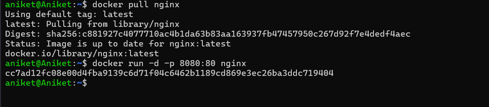
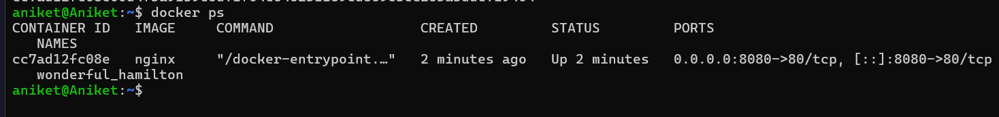
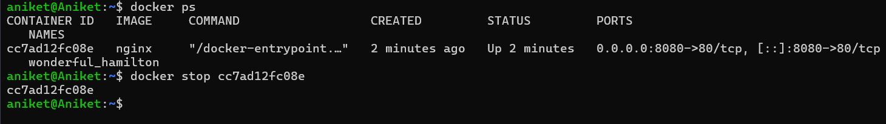
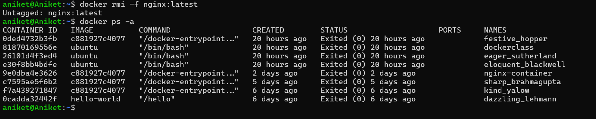

**Containerization and DevOps Lab**

**EXPERIMENT – 02**

**Experiment 2 — Docker Installation, Configuration, and Running Images**

**Objective**

*   To install and configure Docker on the system.
*   To pull and run Docker images.
*   To manage Docker containers using Docker commands.

**Theory / Description**

Docker is a platform for developing, shipping, and running applications using **containers**. Containers are lightweight and portable runtime environments for software that include all necessary dependencies. Docker uses the concept of:

*   **Images** — read-only templates for containers
*   **Containers** — running instances of images

By pulling images from Docker Hub (a public repository), we can run applications in isolated environments consistently across different systems.


**Step 1: Pull an Image from Docker Hub**

```docker pull nginx:latest```

This downloads the nginx image from Docker Hub to your local machine.


**Step 2: Run Container with Port Mapping**

```docker run -d -p 8080:80 nginx```

**Run Container with Port Mapping.** This starts a new container from the nginx image. The -d flag runs it in "detached" mode (background), and -p 8080:80 maps port 8080 on your host to port 80 inside the container.




**Step 3: Verify Running Containers**

```docker ps```

**Verify Running Containers.** This lists all currently active containers, showing their IDs, status, and ports.



**Step 4: Stop and Remove Container**

```docker stop <container\_id>```

```docker rm <container\_id>```

**Stop Container.** This gracefully shuts down a running container using its unique ID.




 **Step 5: Remove Image**

```docker rmi nginx```

**Remove Container.** This deletes the container instance after it has been stopped.



**Results & Conclusion**

*   **Results:** Docker images were successfully retrieved, and containers were managed through their full lifecycle (run, stop, and remove).
*   **Conclusion:** This lab highlighted the efficiency of **containerization** compared to traditional **virtualization** (Vagrant/VirtualBox). While VMs offer stronger isolation, containers are superior for microservices and rapid deployment due to their resource efficiency.

[pull.png]: pull.png