**Containerization and DevOps Lab**

**EXPERIMENT – 03**

**Experiment 3 — Deploying NGINX Using Different Base Images and Comparing Image Layers**

**1. Aim**

The aim of this experiment is to deploy the NGINX web server using various base images—Official, Ubuntu, and Alpine—and to perform a comparative analysis of their image sizes, layer structures, and performance characteristics in a containerized environment.

**2. Objectives**

After completing this lab, you will be able to:

- Deploy NGINX using the **Official nginx image**, an **Ubuntu-based image**, and an **Alpine-based image**.
- Analyze and understand **Docker image layers** and how base images impact final size.
- Compare the **performance, security, and specific use-cases** for each deployment approach.
- Explain the practical application of NGINX as a **reverse proxy, load balancer, and static file server**.

**3. Prerequisites**

To successfully perform this lab, the following are required:

- **Docker** installed and running on your system.
- Basic proficiency with the **Linux command line**.
- Understanding of core Docker concepts: docker run, **Dockerfile**, and **Port mapping**.

**4. Implementation Steps**

**Part 1: Official NGINX Image (Recommended)**

1. **Pull the Image**

   ```Code: docker pull nginx:latest```

   Downloads the most recent official NGINX image from Docker Hub.
   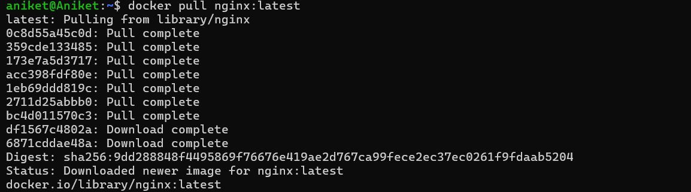

1. **Run the Container**

   ```Code: docker run -d --name nginx-official -p 8080:80 nginx```

   Starts a detached container named nginx-official, mapping host port **8080** to container port **80**.
   

1. **Verification**

   ```Code: curl http://localhost:8080```

   A command-line tool used to verify the NGINX deployment by requesting the home page.
   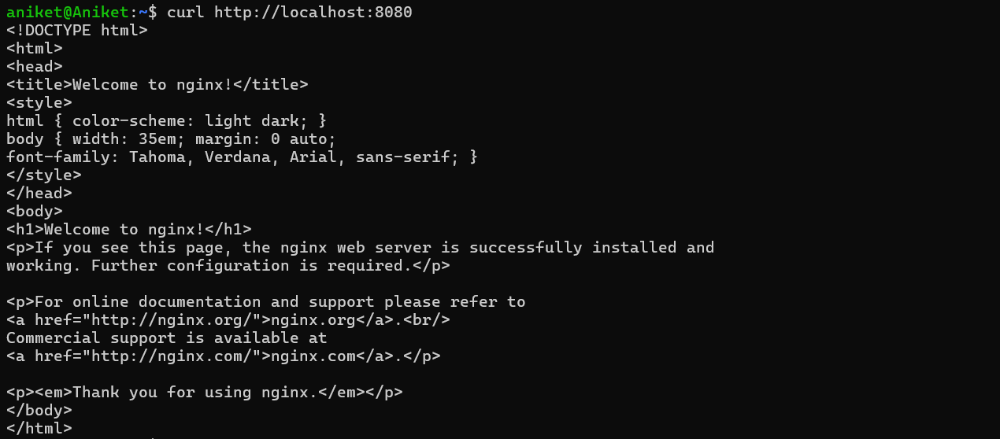

1. **Observation:**

   ```Code: docker images nginx```

   This image is pre-optimized and uses a Debian-based OS internally.
   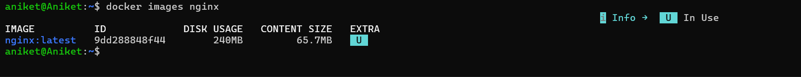
   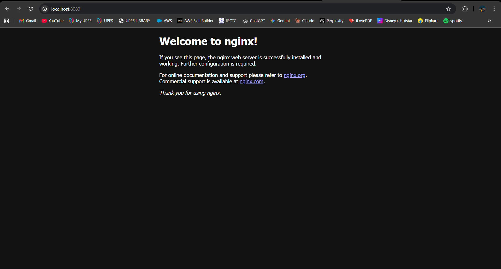

**Part 2: Custom Ubuntu-Based Image**

1. **Create Dockerfile:**
```
Code:

FROM ubuntu:22.04

RUN apt-get update && \

apt-get install -y nginx && \

apt-get clean && \

rm -rf /var/lib/apt/lists/\*

EXPOSE 80

CMD ["nginx", "-g", "daemon off;"]
```

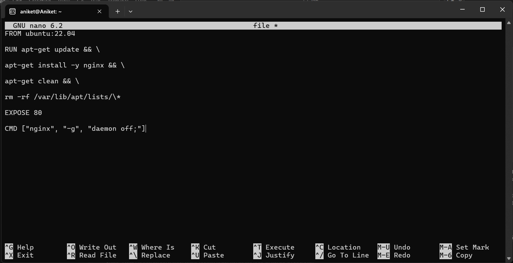

- **FROM ubuntu:22.04**: Uses Ubuntu 22.04 as the starting operating system.
- **RUN apt-get...**: Updates the package list, installs NGINX, and deletes temporary cache files to keep the image size smaller.
- **EXPOSE 80**: Informs Docker that the container listens on port 80 at runtime.
- **CMD ["nginx", "-g", "daemon off;"]**: Starts NGINX in the foreground so the container stays active.

1. **Build and Run:** 

   ```Code: docker build -t nginx-ubuntu .```

   Builds a new custom image named nginx-ubuntu using the instructions in the local Dockerfile.
   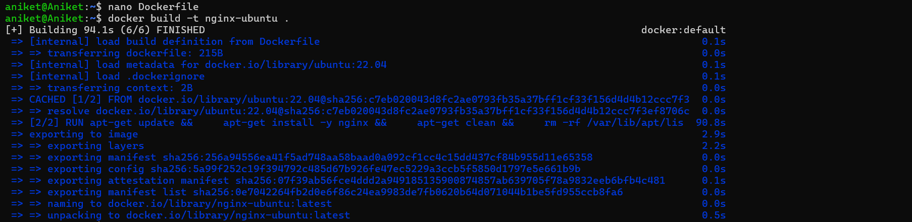

1. **Run Container:**

   ```Code: docker run -d –name nginx-ubuntu -p 8081:80 nginx-ubuntu```
   

1. **Observations**

   ```Code: docker images nginx-ubuntu```

- Much larger image size
- More layers
- Full OS utilities available
  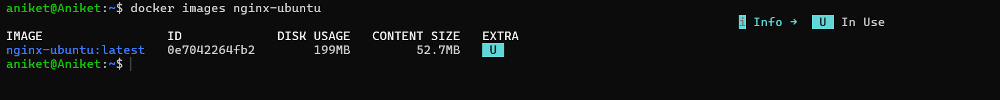

**Part 3: Custom Alpine-Based Image**

1. **Create Dockerfile:**
```
   Code:

   FROM alpine:latest

   RUN apk add --no-cache nginx

   EXPOSE 80

   CMD ["nginx", "-g", "daemon off;"]
```

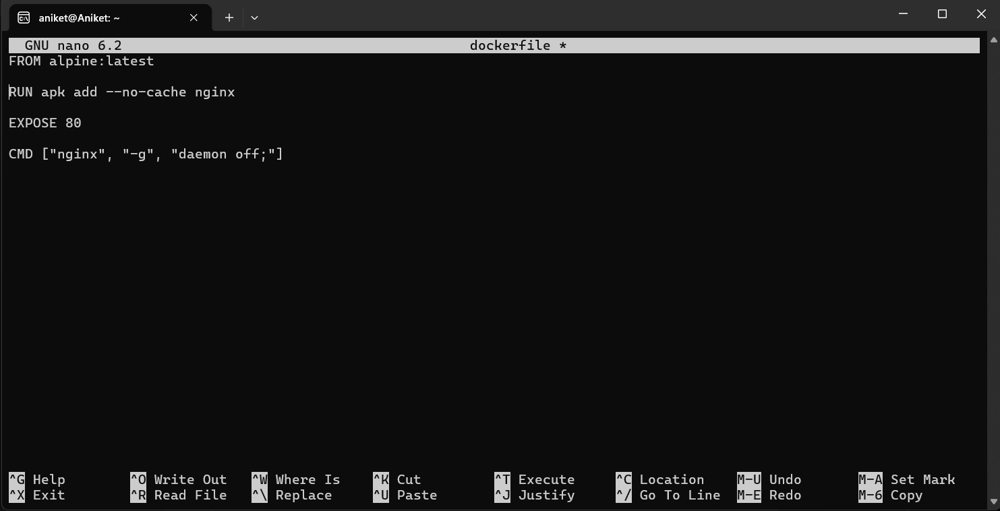

   **FROM alpine:latest**: Uses a minimal Alpine Linux base (approx. 5MB).

   **RUN apk add --no-cache nginx**: Uses the Alpine Package Keeper (apk) to install NGINX without storing the package cache locally.


1. **Build Image:**

   ```Code: docker build -t nginx-apline.```

   Builds a new custom image named nginx-alpine using the Alpine-based Dockerfile.
   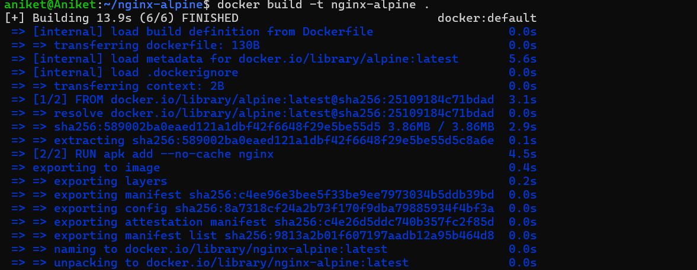

1. **Run Container:**

   ```Code: docker run -d --name nginx-alpine -p 8082:80 nginx-alpine```
   


1. **Observations**

   ```Code: docker images nginx-apline```

- Extremely small image
- Fewer packages
- Faster pull and startup time.
  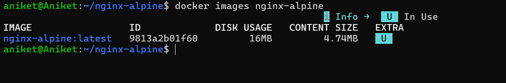


**5. Comparative Analysis**

**Image Size and Layer Comparison**

**Compare Sizes**

```Code: docker images | grep nginx```

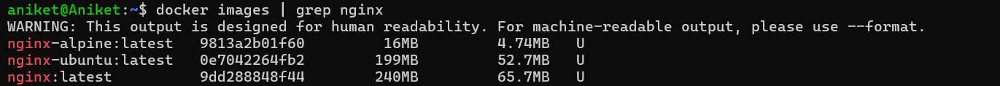

|**Image Type**|**Approx. Size**|**Layers & Observations**|
| :- | :- | :- |
|**nginx:latest**|~140 MB|Optimized for general use; Debian-based.|
|**nginx-ubuntu**|~220+ MB|Largest size; many filesystem layers; full OS utilities.|
|**nginx-alpine**|~25-30 MB|Extremely small; minimal layers; fastest pull/startup.|


**6.Inspect Layers**
```
Code:

docker history nginx

docker history nginx-ubuntu

docker history nginx-alpine
```
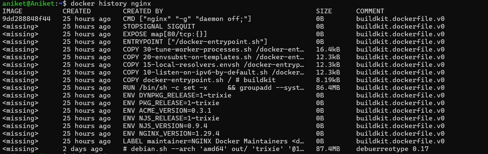
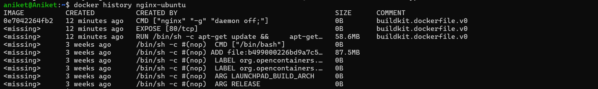


**Observations:**

- Ubuntu has many filesystem layers
- Alpine has minimal layers
- Official NGINX image is optimized but heavier than Alpine
-----
**7. Functional Tasks Using NGINX**

**Task 1: Serve Custom HTML Page**

This task demonstrates how to use **Docker Volumes** to serve your own web content without rebuilding the NGINX image.

**Step 1: Prepare Local Files** Create a directory and a basic HTML file on your host machine:
```
mkdir html 
echo "<h1>Hello from Docker NGINX</h1>" > html/index.html 
```
**Step 2: Run the Container with Volume Mapping** Execute the following command to link your local html folder to the NGINX default directory inside the container:
```
Bash

docker run -d \
-p 8083:80 \
-v $(pwd)/html:/usr/share/nginx/html \
nginx
```

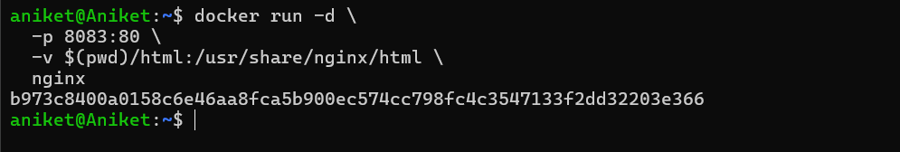

- **-v $(pwd)/html:/usr/share/nginx/html**: This maps your current directory's HTML folder to the NGINX web root.
- **-p 8083:80**: Maps host port 8083 to container port 80.
-----
**Task 2: Reverse Proxy (Conceptual)**

This task explores how NGINX acts as an intermediary between clients and backend services.

**Core Capabilities of NGINX as a Proxy:**

- **Traffic Forwarding**: It acts as a gateway, forwarding incoming traffic to specific backend services.
- **Load Balancing**: It can distribute incoming requests across multiple backend containers to ensure stability.
- **SSL Termination**: NGINX handles the encryption/decryption (HTTPS), allowing backend services to run on simpler HTTP.

**Common Real-World Use Cases:**

- **Frontend for Microservices**: Serving as the single entry point for complex application architectures.
- **API Gateway**: Routing API calls and managing traffic.
- **Static File Server**: Efficiently delivering images, CSS, and JavaScript files.
-----
**8 . Comparison Summary**

**Image Comparison Table**

The following table summarizes the key differences between the Official, Ubuntu-based, and Alpine-based images:

|**Feature**|**Official NGINX**|**Ubuntu + NGINX**|**Alpine + NGINX**|
| :- | :- | :- | :- |
|**Image Size**|Medium |Large |Very Small |
|**Ease of Use**|Very Easy |Medium |Medium |
|**Startup Time**|Fast |Slow |Very Fast |
|**Debugging Tools**|Limited |Excellent |Minimal |
|**Security Surface**|Medium |Large |Small |
|**Production Ready**|Yes |Rarely |Yes |

-----
**Key Takeaways from the Comparison**

- **Size Efficiency:** The Alpine-based image is the most compact (approx. 25-30 MB), making it ideal for fast deployment and minimal resource consumption.
- **Utility vs. Weight:** While the Ubuntu-based image is significantly larger (approx. 220+ MB), it provides a full suite of OS utilities that are useful for heavy debugging.
- **Security:** Alpine offers the smallest security surface, which is a critical factor for production environments.
- **Standardization:** The Official NGINX image is the most balanced and widely used for standard web hosting and production-grade reverse proxies.

**9. When to Use What**

Based on the performance and size characteristics observed in the previous sections, here are the recommended use cases for each NGINX deployment strategy:

**Use Official NGINX Image When:**

- You are deploying to a **production environment**.
- You need a reliable solution for **standard web hosting**.
- You are setting up a **reverse proxy** or a **load balancer**.

**Use Ubuntu-Based Image When:**

- You are **learning Linux** and NGINX internals.
- You require **heavy debugging** tools that are not present in minimal images.
- Your application has **custom system-level dependencies** that are easier to manage in a full Ubuntu environment.

**Use Alpine-Based Image When:**

- You are building **microservices** where image size is critical.
- You are optimizing **CI/CD pipelines** for faster build and push times.
- You are deploying to **Cloud and Kubernetes workloads**.

**10. Conclusion**

The choice of base image significantly impacts container efficiency. **Alpine** is preferred for microservices and CI/CD due to its small footprint. **Ubuntu** is useful for learning and heavy debugging but is generally avoided in production due to its large security surface. The **Official image** remains the standard for most production web hosting and proxy needs.


