### Containerization and DevOps Lab

**EXPERIMENT – 04**

**Experiment 4 — Docker Essentials (Dockerfile, .dockerignore, Tagging and Publishing)**

**1\. Aim**

To understand Docker Essentials including Dockerfile creation, .dockerignore usage, image tagging, multi-stage builds, and publishing Docker images to Docker Hub.

**2\. Objectives**

After completing this experiment, you will be able to:

*   Containerize applications using a Dockerfile.
*   Use .dockerignore to exclude unnecessary files.
*   Build and tag Docker images.
*   Run and manage Docker containers.
*   Implement multi-stage builds.
*   Publish Docker images to Docker Hub.
*   Understand development and production workflows.

**3\. Prerequisites**

*   Docker installed and running.
*   Basic knowledge of:
    *   Dockerfile
    *   docker build
    *   docker run
    *   docker tag
    *   docker push

### 4\. Implementation Steps

**Part 1: Containerizing Applications with Dockerfile**

**Step 1: Create a Simple Application (Flask App)**

```
Code :

mkdir my-flask-app
cd my-flask-app
```
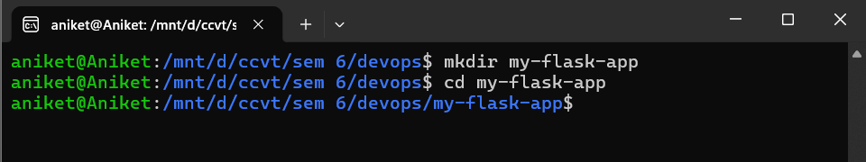

```app.py```

```
Code :

from flask import Flask
app = Flask(__name__)

@app.route('/')
def hello():
    return "Hello from Docker!"

@app.route('/health')
def health():
    return "OK"

if __name__ == '__main__':
    app.run(host='0.0.0.0', port=5000)

```
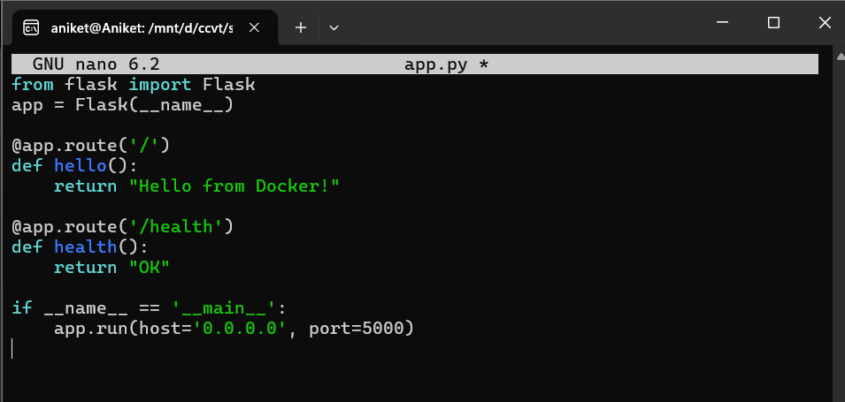

**requirements.txt**

```Flask==2.3.3```

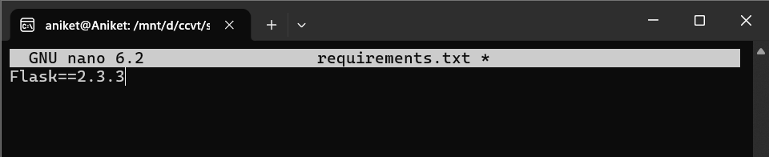

**Step 2: Create Dockerfile**

```
Code :

FROM python:3.9-slim
WORKDIR /app
COPY requirements.txt .
RUN pip install --no-cache-dir -r requirements.txt
COPY app.py .
EXPOSE 5000
CMD \["python", "app.py"\]
```
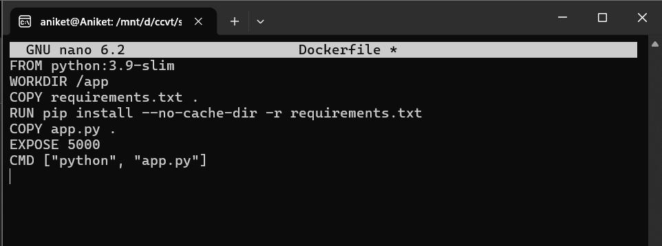

**Part 2: Using .dockerignore**

**Step 1: Create .dockerignore File**

```.dockerignore : ```


```
Code :

# Python files
__pycache__/
*.pyc
*.pyo
*.pyd

# Environment files
.env
.venv
env/
venv/

# IDE files
.vscode/
.idea/

# Git files
.git/
.gitignore

# OS files
.DS_Store
Thumbs.db

# Logs
*.log
logs/

# Test files
tests/
test_*.py
```
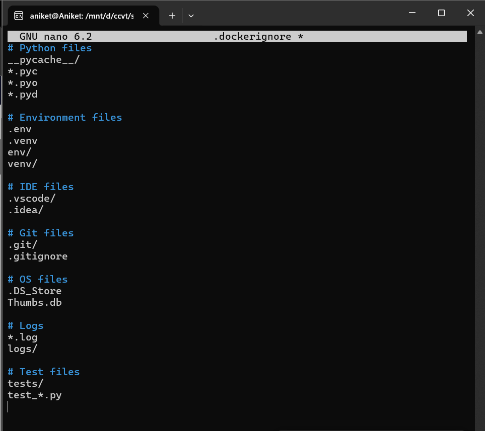

**Step 2: Why .dockerignore is Important**

*   Prevents unnecessary files from being copied.
*   Reduces image size.
*   Improves build speed.
*   Increases security.

**Part 3: Building Docker Images**

**Step 1: Basic Build Command**

```
Code :

docker build -t my-flask-app .
docker images
```
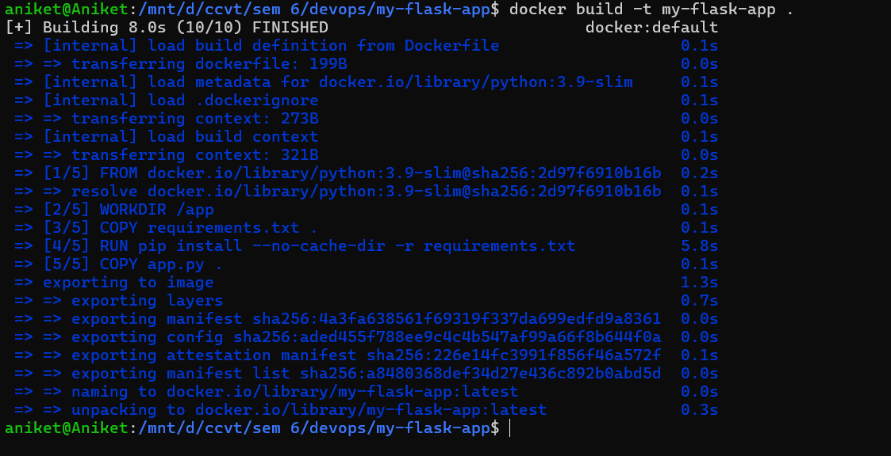
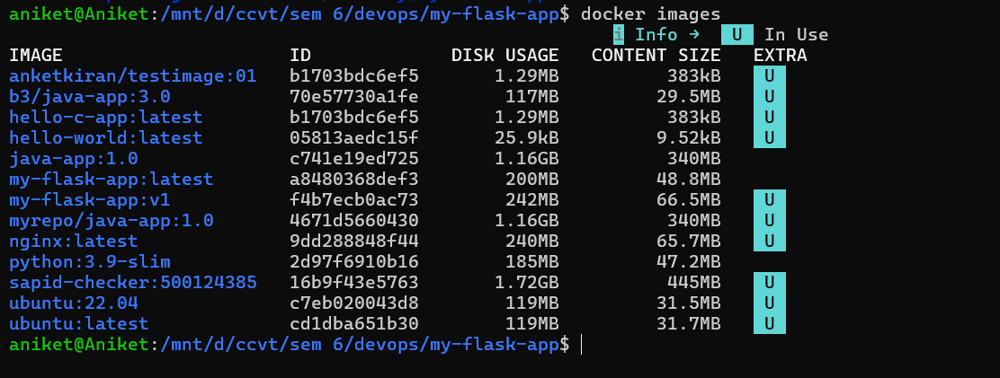
docker build -t my-flask-app .  
Used to build a Docker image from the Dockerfile in the current directory.  
\-t assigns a name (tag) to the image.

docker images  
Used to list all Docker images and verify that the image was built successfully.

**Step 2: Tagging Images**

```
Code :

docker build -t my-flask-app:1.0 .
docker build -t my-flask-app:latest -t my-flask-app:1.0 .
docker build -t username/my-flask-app:1.0 .
docker tag my-flask-app:latest my-flask-app:v1.0
```
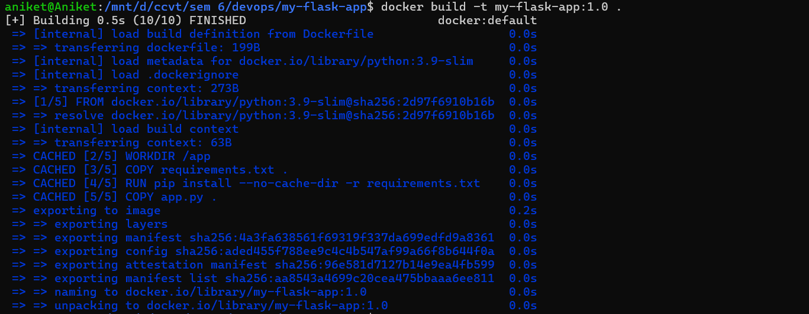
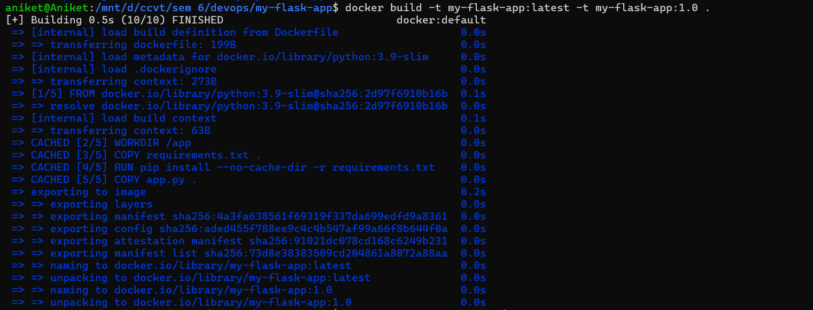
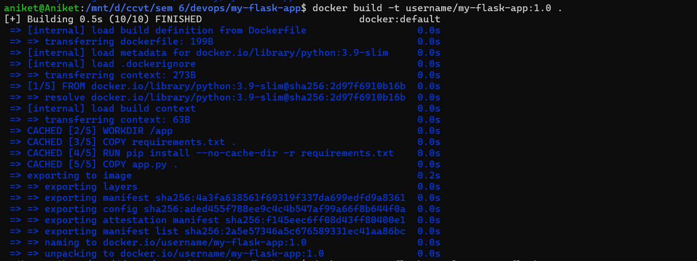
docker build -t my-flask-app:1.0 .  
Builds image with a specific version tag.

docker build -t my-flask-app:latest -t my-flask-app:1.0 .  
Assigns multiple tags to the same image.

docker build -t username/my-flask-app:1.0 .  
Tags image for Docker Hub publishing.

docker tag my-flask-app:latest my-flask-app:v1.0  
Adds an additional tag to an existing image without rebuilding.

**Step 3: View Image Details**

```
Code :

docker images
docker history my-flask-app
docker inspect my-flask-app
```
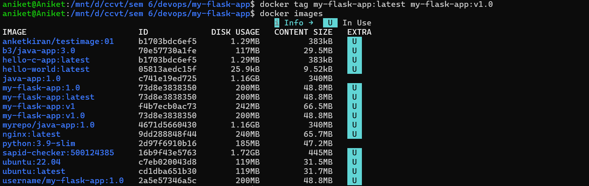
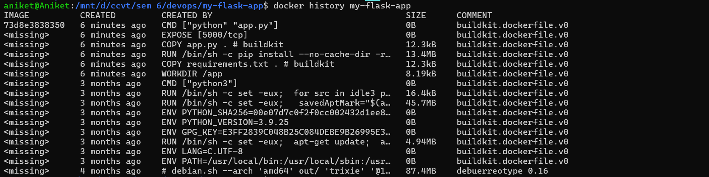
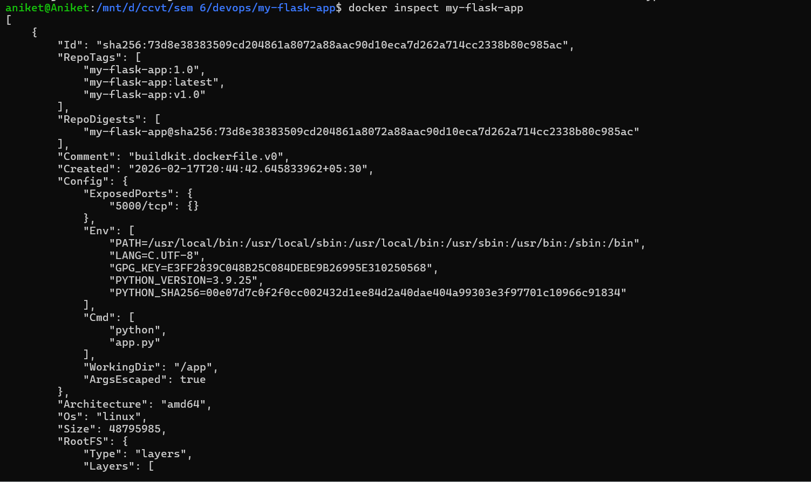
docker images → Lists all images.

docker history → Shows image layer history.

docker inspect → Displays detailed configuration and metadata.

**Part 4: Running Containers**

**Step 1: Run Container**

```
Code :

docker run -d -p 5000:5000 --name flask-container my-flask-app
curl [http://localhost:5000](http://localhost:5000)
```
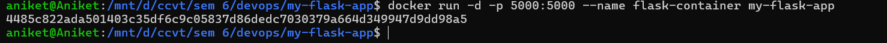
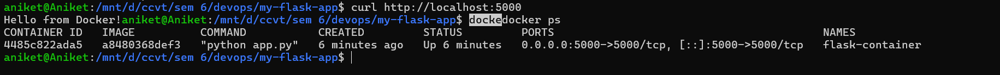
docker run → Creates and starts a container from the image.

\-d → Runs container in background.

\-p 5000:5000 → Maps host port to container port.

\--name → Assigns custom container name.

curl → Tests whether the application is running.

**Step 2: Manage Containers**

```

Code :
docker ps
docker logs flask-container
docker stop flask-container
docker start flask-container
docker rm flask-container
docker rm -f flask-container
```
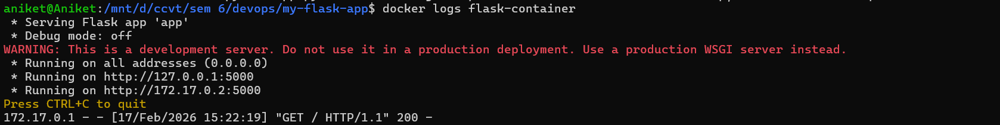
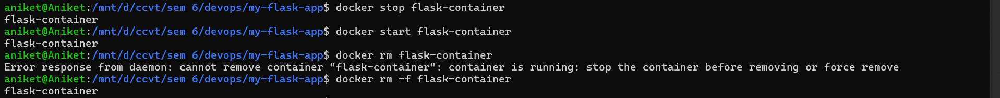
docker ps → Lists running containers.

docker logs → Shows container output logs.

docker stop → Stops a running container.

docker start → Restarts a stopped container.

docker rm → Removes stopped container.

docker rm -f → Forcefully removes running container.

**Part 5: Multi-stage Builds**

**Step 1: Why Multi-stage Builds?**

*   Smaller final image size
*   Better security
*   Separate build and runtime environments

**Step 2: Multi-stage Dockerfile**

```Dockerfile.multistage : ```

```
Code :

# STAGE 1: Builder stage
FROM python:3.9-slim AS builder

WORKDIR /app

# Copy requirements
COPY requirements.txt .

# Install dependencies in virtual environment
RUN python -m venv /opt/venv
ENV PATH="/opt/venv/bin:$PATH"
RUN pip install --no-cache-dir -r requirements.txt

# STAGE 2: Runtime stage
FROM python:3.9-slim

WORKDIR /app

# Copy virtual environment from builder
COPY --from=builder /opt/venv /opt/venv
ENV PATH="/opt/venv/bin:$PATH"

# Copy application code
COPY app.py .

# Create non-root user
RUN useradd -m -u 1000 appuser
USER appuser

# Expose port
EXPOSE 5000

# Run application
CMD ["python", "app.py"]
```
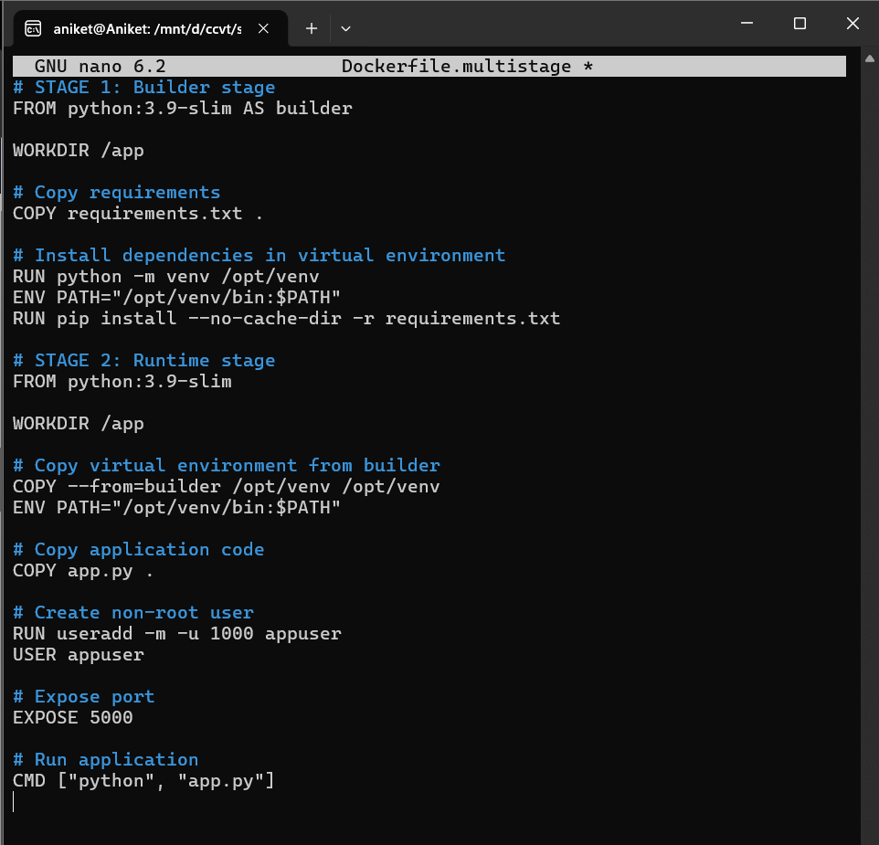
**Step 3: Build and Compare**

```
Code :

# Build regular image
docker build -t flask-regular .

# Build multi-stage image
docker build -f Dockerfile.multistage -t flask-multistage .

# Compare sizes
docker images | grep flask-

# Expected output:
# flask-regular     ~250MB
# flask-multistage  ~200MB 
```
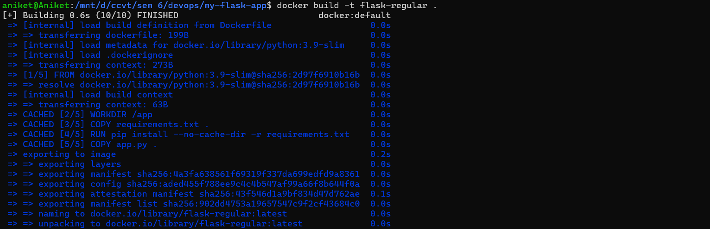
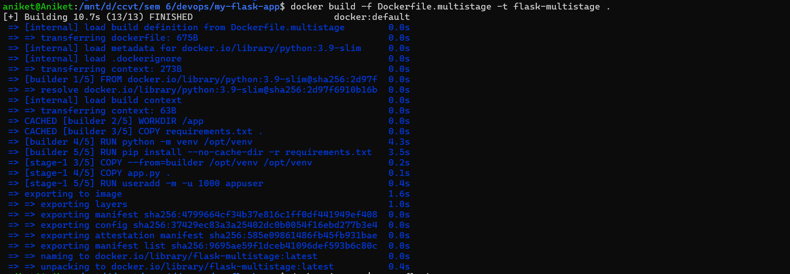
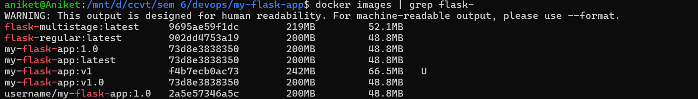

docker build -t flask-regular .  
Builds normal Docker image.

docker build -f Dockerfile.multistage -t flask-multistage .  
Builds image using multi-stage Dockerfile.

docker images | grep flask-  
Compares image sizes to verify reduction.

**Part 6: Publishing to Docker Hub**

**Step 1: Prepare for Publishing**

```

Code :

# Login to Docker Hub
docker login

# Tag image for Docker Hub
docker tag my-flask-app:latest username/my-flask-app:1.0
docker tag my-flask-app:latest username/my-flask-app:latest

# Push to Docker Hub
docker push username/my-flask-app:1.0
docker push username/my-flask-app:latest
```
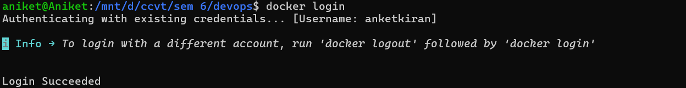
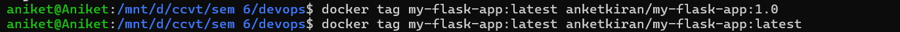
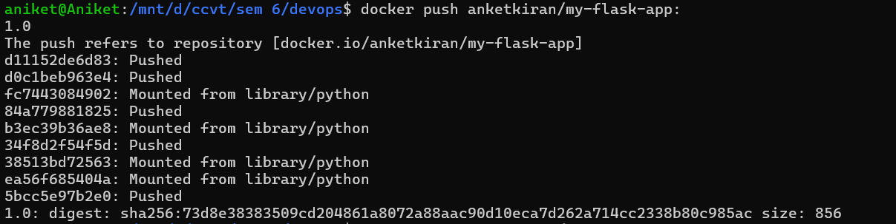
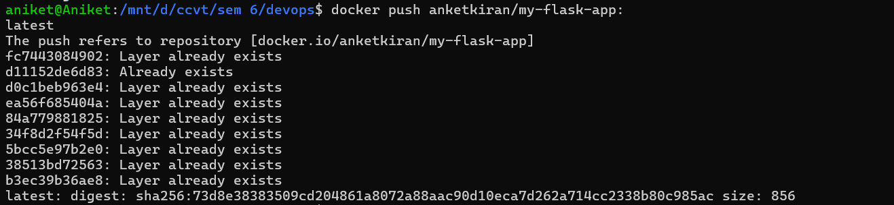

**Step 2: Pull and Run**

```

Code :

# Pull from Docker Hub (on another machine)
docker pull username/my-flask-app:latest

# Run the pulled image
docker run -d -p 5000:5000 username/my-flask-app:latest
```
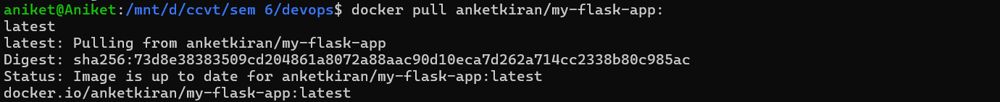
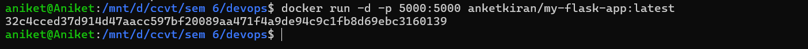
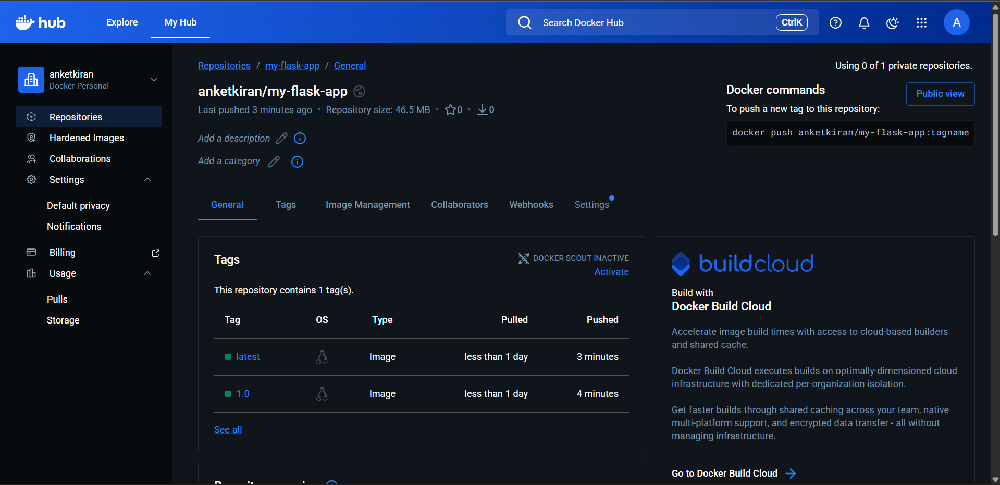

**Part 7: Node.js Example**

**Node Application**

```
Code :

mkdir my-node-app
cd my-node-app
```
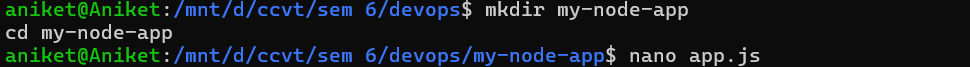
```app.js```

```

Code :

const express = require('express');

const app = express();

const port = 3000;

app.get('/', (req, res) => {

res.send('Hello from Node.js Docker!');

});

app.get('/health', (req, res) => {

res.json({ status: 'healthy' });

});

app.listen(port, () => {

console.log(\`Server running on port ${port}\`);

});

```
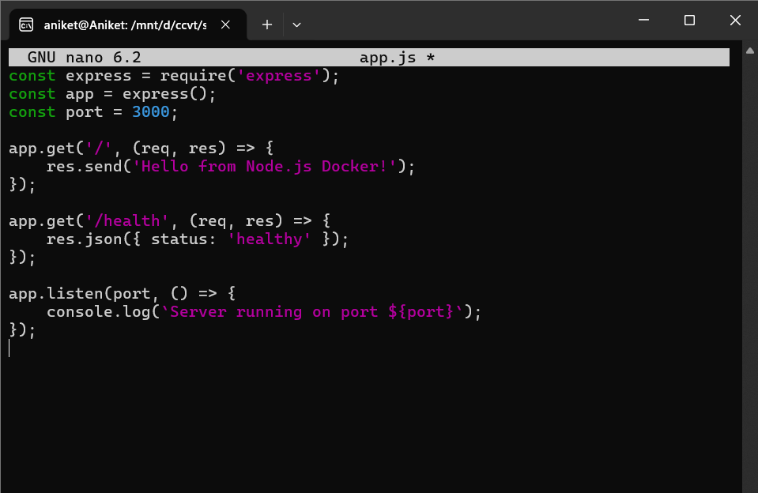

```package.json :```

```

**Code :**

{

"name": "node-docker-app",

"version": "1.0.0",

"main": "app.js",

"dependencies": {

"express": "^4.18.2"

}

}
```
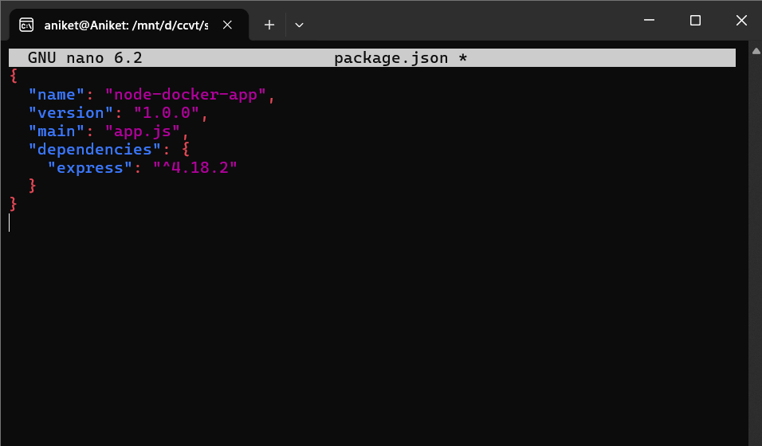

**Dockerfile**

```

Code :

FROM node:18-alpine

WORKDIR /app

COPY package\*.json ./

RUN npm install --only=production

COPY app.js .

EXPOSE 3000

CMD \["node", "app.js"\]
```
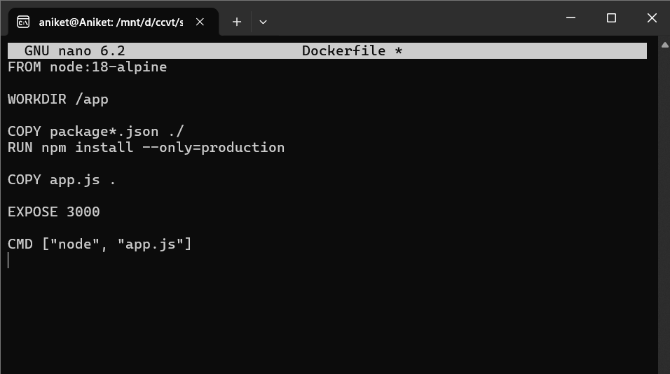

**Build and Run**

```

Code :

# Build image
docker build -t my-node-app .

# Run container
docker run -d -p 3000:3000 --name node-container my-node-app

# Test
curl http://localhost:3000
```
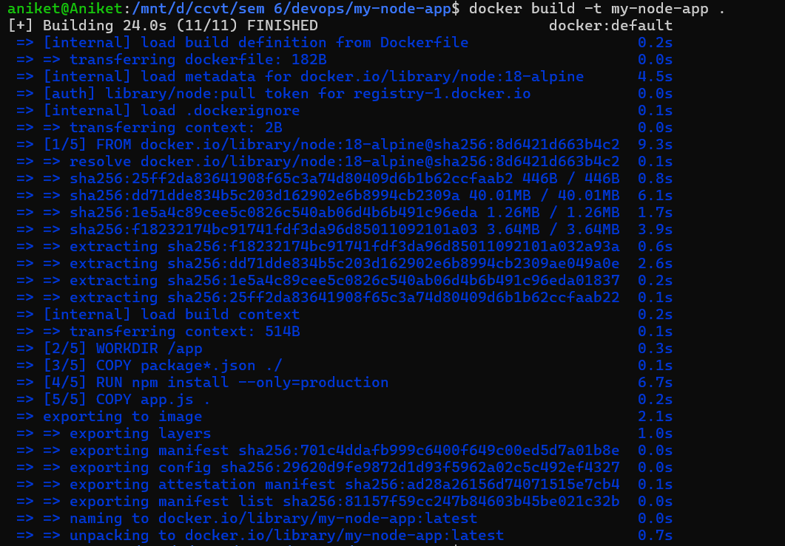
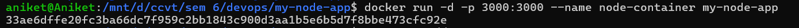
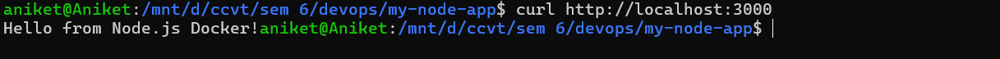

**Common Workflow Summary**

**Development Workflow**

```

# 1. Create Dockerfile and .dockerignore
# 2. Build image
docker build -t myapp .

# 3. Test locally
docker run -p 8080:8080 myapp

# 4. Tag for production
docker tag myapp:latest myapp:v1.0

# 5. Push to registry
docker push myapp:v1.0
```

**Production Workflow**

```
# 1. Pull from registry
docker pull myapp:v1.0

# 2. Run in production
docker run -d -p 80:8080 --name prod-app myapp:v1.0

# 3. Monitor
docker logs -f prod-app
```

**Key Takeaways**

1.  Dockerfile defines how to build an image.
2.  .dockerignore excludes unnecessary files.
3.  Tagging helps version control images.
4.  Multi-stage builds create smaller images.
5.  Docker Hub allows sharing images.
6.  Always test locally before publishing.

**Cleanup**

```
Code :

docker container prune
docker image prune
docker system prune -a
```