# Lab – Experiment 6

## Docker Run vs Docker Compose: Multi-Container Application Orchestration

## Lab Objectives

- Understand the relationship between `docker run` (imperative) and Docker Compose (declarative) approaches
- Compare Docker Run command flags with Docker Compose YAML configuration
- Deploy single and multi-container applications using both methods
- Convert Docker Run commands to Docker Compose configuration
- Manage volumes, networks, and environment variables with Docker Compose
- Use Dockerfile with Docker Compose build option
- Deploy production-ready applications with container orchestration

---
## Prerequisites
- Docker installed and running
- Basic knowledge of: `docker run`, port mapping, volume mounting, networking
- Understanding of YAML file format
- Familiarity with environment variables

---
## Part A – Theory

### 2.1 Docker Run (Imperative Approach)

The `docker run` command creates and starts a container from an image. It requires explicit flags for configuration, making it an **imperative** approach (step-by-step instructions).

**Common Docker Run Flags:**

| Flag | Purpose |
|------|---------|
| `-p` | Port mapping (HOST:CONTAINER) |
| `-v` | Volume mounting (HOST:CONTAINER) |
| `-e` | Environment variables |
| `--network` | Network configuration |
| `--restart` | Restart policies |
| `--memory` | Memory limits |
| `--cpus` | CPU limits |
| `--name` | Container name |
| `-d` | Run in detached mode |

**Advantages:**
- Direct control over each parameter
- Quick testing and experimentation
- Suitable for simple one-off container runs

**Disadvantages:**
- Complex to manage multiple containers
- Difficult to version and reproduce
- Error-prone with long command chains
- Not suitable for production deployments

**Example – Running Nginx with Docker Run:**

```bash
docker run -d \
  --name my-nginx \
  -p 8080:80 \
  -v ./html:/usr/share/nginx/html \
  -e NGINX_HOST=localhost \
  --restart unless-stopped \
  nginx:alpine
```

| Flag | Explanation |
|------|-------------|
| `-d` | Detached mode (runs in background) |
| `--name my-nginx` | Assigns container name |
| `-p 8080:80` | Maps host port 8080 to container port 80 |
| `-v ./html:/usr/share/nginx/html` | Mounts HTML files into Nginx directory |
| `-e NGINX_HOST=localhost` | Sets environment variable |
| `--restart unless-stopped` | Restarts container unless manually stopped |
| `nginx:alpine` | Uses lightweight Nginx image |

---

### 2.2 Docker Compose (Declarative Approach)

Docker Compose uses a YAML file (`docker-compose.yml`) to define services, networks, and volumes in a structured format. It is **declarative** — you define the desired state rather than step-by-step instructions.

**Advantages:**
- Simplifies multi-container applications
- Provides reproducibility and version control
- Unified lifecycle management (`up`, `down`, `logs`, etc.)
- Supports service scaling
- Automatic networking between services
- Easy to document and share

**Disadvantages:**
- Limited to single-host only (no built-in clustering)
- Requires understanding of YAML syntax
- No auto-scaling or self-healing

**Equivalent Docker Compose for the above:**

```yaml
version: '3.8'

services:
  nginx:
    image: nginx:alpine
    container_name: my-nginx
    ports:
      - "8080:80"
    volumes:
      - ./html:/usr/share/nginx/html
    environment:
      NGINX_HOST: localhost
    restart: unless-stopped
```

| YAML Key | Explanation |
|----------|-------------|
| `version` | Docker Compose file format version |
| `services` | Defines all containers |
| `nginx` | Service name (used for container networking) |
| `image` | Docker image to use |
| `container_name` | Container name (optional) |
| `ports` | Port mappings (HOST:CONTAINER) |
| `volumes` | Data persistence mappings |
| `environment` | Environment variables for the service |
| `restart` | Restart policy |

---

### 3. Mapping: Docker Run vs Docker Compose

| Docker Run Flag | Docker Compose Equivalent | Purpose |
|---|---|---|
| `-p 8080:80` | `ports:` `- "8080:80"` | Port mapping |
| `-v host:container` | `volumes:` `- host:container` | Volume mounting |
| `-e KEY=value` | `environment:` `KEY: value` | Environment variables |
| `--name` | `container_name:` | Container name |
| `--network` | `networks:` or auto | Network configuration |
| `--restart` | `restart:` | Restart policy |
| `--memory` | `deploy.resources.limits.memory` | Memory limit |
| `--cpus` | `deploy.resources.limits.cpus` | CPU limit |
| `-d` | `docker compose up -d` | Detached mode |

---

### 4. Advantages of Docker Compose

1. **Simplifies multi-container applications** – Single command manages all services
2. **Provides reproducibility** – Same configuration works everywhere
3. **Version controllable configuration** – Track changes in git
4. **Unified lifecycle management** – Deploy and destroy complete stacks
5. **Supports service scaling** – `docker compose up --scale web=3`
6. **Automatic service discovery** – Services can reach each other by name
7. **Clear documentation** – YAML file documents the entire stack

---

## Part B – Practical Tasks

### Task 1: Single Container Comparison

#### Step 1: Run Nginx Using Docker Run

```bash
docker run -d \
  --name lab-nginx \
  -p 8081:80 \
  -v $(pwd)/html:/usr/share/nginx/html \
  nginx:alpine
```

| Flag | Explanation |
|------|-------------|
| `docker run` | Create and start a new container |
| `-d` | Run in detached mode (background) |
| `--name lab-nginx` | Assign name "lab-nginx" to the container |
| `-p 8081:80` | Map host port 8081 to container port 80 |
| `-v $(pwd)/html:/usr/share/nginx/html` | Mount current directory's `html` folder to Nginx document root |
| `nginx:alpine` | Use lightweight Nginx image |

**Verify the container is running:**

```bash
docker ps
```

**Terminal Output:**
```
CONTAINER ID   IMAGE          COMMAND                  CREATED          STATUS          PORTS                                   NAMES
62a1df7f954d   nginx:alpine   "/docker-entrypoint.…"   23 seconds ago   Up 22 seconds   0.0.0.0:8081->80/tcp, [::]:8081->80/tcp   lab-nginx
```

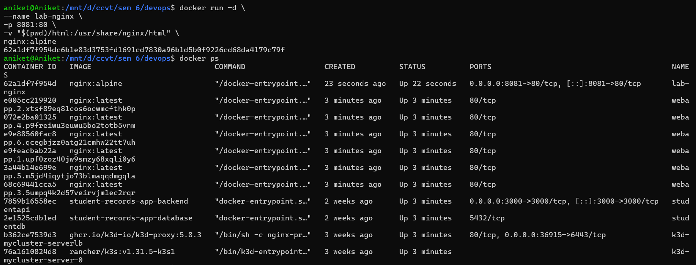

**Access the web server:** `http://localhost:8081`

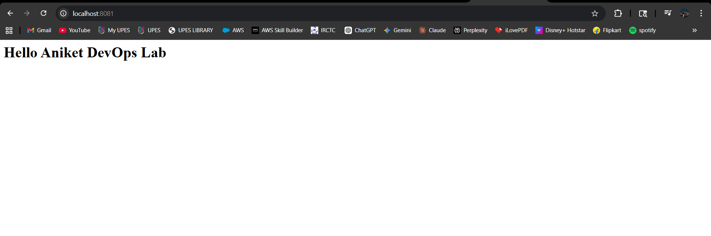

**Clean up:**

```bash
docker stop lab-nginx
docker rm lab-nginx
```
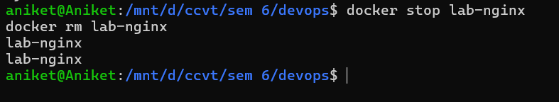
---

#### Step 2: Run Same Setup Using Docker Compose

**`docker-compose.yml`:**

```yaml
version: '3.8'

services:
  nginx:
    image: nginx:alpine
    container_name: lab-nginx
    ports:
      - "8081:80"
    volumes:
      - ./html:/usr/share/nginx/html
```

**Deploy the stack:**

```bash
docker compose up -d
```

**Terminal Output:**
```
WARN[0000] docker-compose.yml: the attribute `version` is obsolete, it will be ignored
[+] Running 2/2
 ✔ Network devops_default  Created   0.1s
 ✔ Container lab-nginx     Started   0.2s
```

**Verify services:**

```bash
docker compose ps
```

**Terminal Output:**
```
NAME        IMAGE          COMMAND                  SERVICE   CREATED          STATUS          PORTS
lab-nginx   nginx:alpine   "/docker-entrypoint.…"   nginx     42 seconds ago   Up 41 seconds   0.0.0.0:8081->80/tcp
```

**Stop and remove the stack:**

```bash
docker compose down
```

**Terminal Output:**
```
[+] Running 2/2
 ✔ Container lab-nginx     Removed   0.5s
 ✔ Network devops_default  Removed   0.3s
```
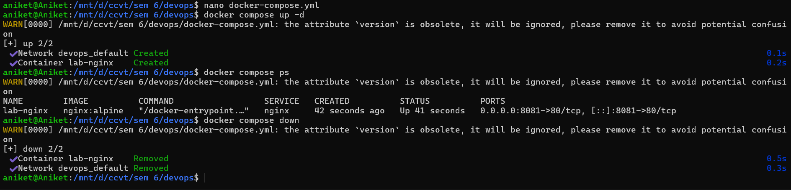
---

### Task 2: Multi-Container Application – WordPress + MySQL

#### A. Using Docker Run

**Step 1: Create custom network**

```bash
docker network create wp-net
```

**Step 2: Run MySQL container**

```bash
docker run -d \
  --name mysql \
  --network wp-net \
  -e MYSQL_ROOT_PASSWORD=secret \
  -e MYSQL_DATABASE=wordpress \
  mysql:5.7
```

| Flag | Explanation |
|------|-------------|
| `--network wp-net` | Connects container to the custom network |
| `-e MYSQL_ROOT_PASSWORD=secret` | Sets MySQL root password |
| `-e MYSQL_DATABASE=wordpress` | Creates database named "wordpress" |
| `mysql:5.7` | Uses MySQL version 5.7 image |

<!-- Screenshot: MySQL container running -->
<!-- [Add screenshot here: images/task2_mysql_run.png] -->

> Wait 10–15 seconds for MySQL to be ready before starting WordPress.

**Step 3: Run WordPress container**

```bash
docker run -d \
  --name wordpress \
  --network wp-net \
  -p 8082:80 \
  -e WORDPRESS_DB_HOST=mysql \
  -e WORDPRESS_DB_PASSWORD=secret \
  wordpress:latest
```

| Flag | Explanation |
|------|-------------|
| `--network wp-net` | Connects to same network as MySQL |
| `-p 8082:80` | Maps port 8082 to WordPress port 80 |
| `-e WORDPRESS_DB_HOST=mysql` | Service name "mysql" autodiscovered via DNS |
| `-e WORDPRESS_DB_PASSWORD=secret` | Password matching MySQL configuration |

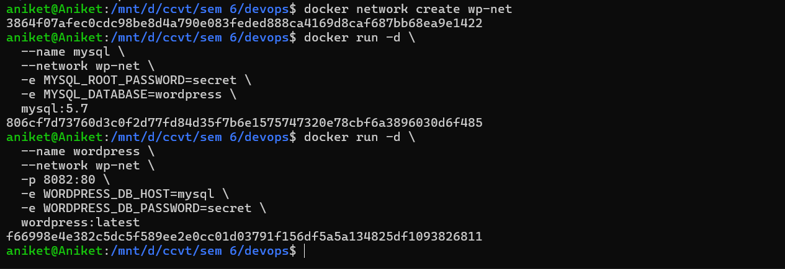

**Verify containers:**

```bash
docker ps
```

**Terminal Output:**
```
CONTAINER ID   IMAGE              COMMAND                  CREATED          STATUS          PORTS                                   NAMES
f66998e4e382   wordpress:latest   "docker-entrypoint.s…"   2 minutes ago    Up 2 minutes    0.0.0.0:8082->80/tcp, [::]:8082->80/tcp   wordpress
806cf7d73760   mysql:5.7          "docker-entrypoint.s…"   3 minutes ago    Up 3 minutes    3306/tcp, 33060/tcp                       mysql
```

**Access WordPress:** `http://localhost:8082`

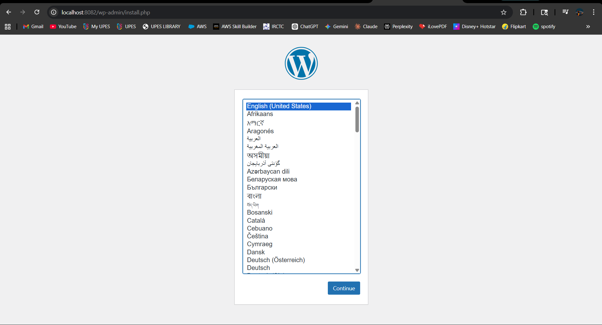

**Clean up:**

```bash
docker stop wordpress mysql
docker rm wordpress mysql
docker network rm wp-net
```

---

#### B. Using Docker Compose

**`wp-compose-lab/docker-compose.yml`:**

```yaml
version: '3.8'

services:
  db:
    image: mysql:5.7
    container_name: wordpress_db
    restart: always
    environment:
      MYSQL_ROOT_PASSWORD: rootpass
      MYSQL_DATABASE: wordpress
      MYSQL_USER: wpuser
      MYSQL_PASSWORD: wppass
    volumes:
      - db_data:/var/lib/mysql

  wordpress:
    image: wordpress:latest
    container_name: wordpress_app
    depends_on:
      - db
    ports:
      - "8080:80"
    restart: always
    environment:
      WORDPRESS_DB_HOST: db:3306
      WORDPRESS_DB_USER: wpuser
      WORDPRESS_DB_PASSWORD: wppass
      WORDPRESS_DB_NAME: wordpress
    volumes:
      - wp_data:/var/www/html

volumes:
  db_data:
  wp_data:
```

| YAML Key | Explanation |
|----------|-------------|
| `depends_on` | Ensures MySQL starts before WordPress |
| `WORDPRESS_DB_HOST: db` | Uses service name for DNS discovery |
| `volumes` | Creates named volumes for persistent data |
| `db_data` | Stores database files |
| `wp_data` | Stores WordPress application files |

**Deploy the stack:**

```bash
docker compose up -d
```

**Terminal Output:**
```
[+] Running 5/5
 ✔ Network wp-compose-lab_default    Created   0.0s
 ✔ Volume wp-compose-lab_db_data     Created   0.0s
 ✔ Volume wp-compose-lab_wp_data     Created   0.0s
 ✔ Container wordpress_db            Started   0.1s
 ✔ Container wordpress_app           Started   0.1s
```
**Verify services and volumes:**

```bash
docker ps
docker volume ls
```

**Volume output includes:**
```
local     wp-compose-lab_db_data
local     wp-compose-lab_wp_data
```
**Access WordPress:** `http://localhost:8080`

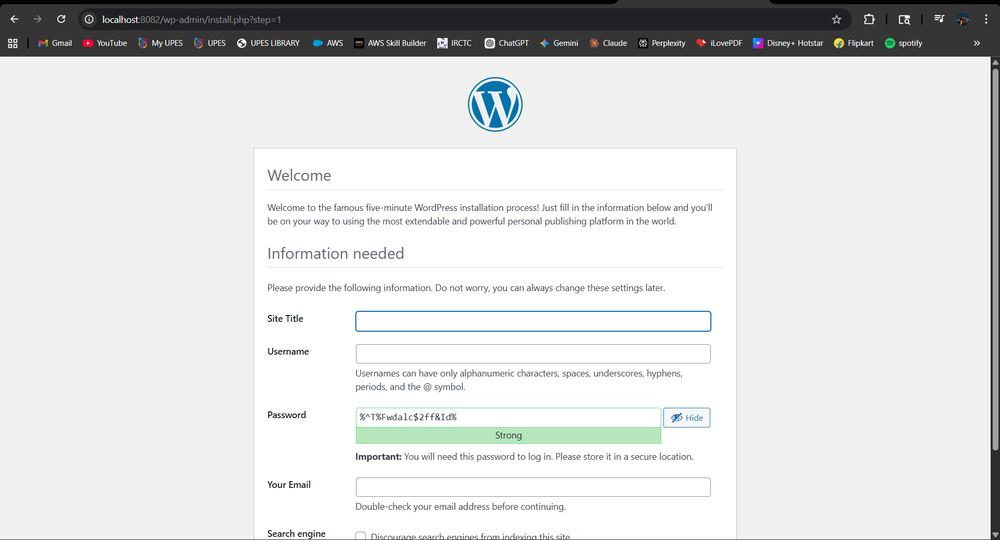

**Stop and clean up everything (including volumes):**

```bash
docker compose down -v
```

> ⚠️ `-v` flag removes volumes along with containers. Use with caution — this deletes data!

**Terminal Output:**
```
[+] Running 4/4
 ✔ Container wordpress_app        Removed   1.4s
 ✔ Container wordpress_db         Removed   1.5s
 ✔ Volume wp-compose-lab_wp_data  Removed   0.1s
 ✔ Volume wp-compose-lab_db_data  Removed   0.2s
 ✔ Network wp-compose-lab_default Removed   0.3s
```
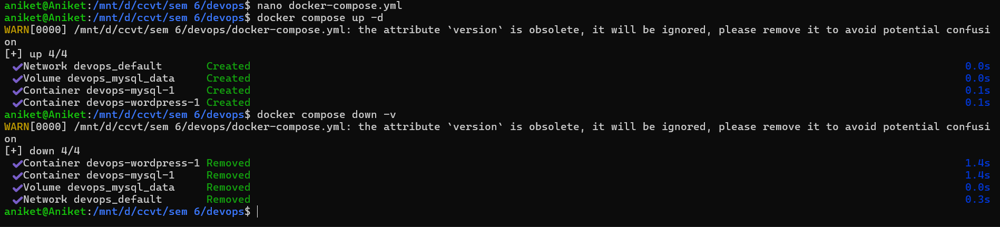
---

## Part C – Conversion & Build-Based Tasks

### Task 3: Convert Docker Run to Docker Compose

#### Problem 1: Basic Web Application

**Given Docker Run Command:**

```bash
docker run -d \
  --name webapp \
  -p 5000:5000 \
  -e APP_ENV=production \
  -e DEBUG=false \
  --restart unless-stopped \
  node:18-alpine
```

**Equivalent `docker-compose.yml`:**

```yaml
version: '3.8'

services:
  webapp:
    image: node:18-alpine
    container_name: webapp
    ports:
      - "5000:5000"
    environment:
      APP_ENV: production
      DEBUG: "false"
    restart: unless-stopped
```

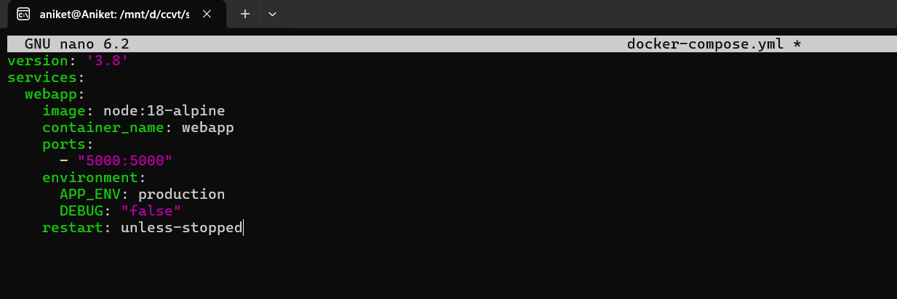

**Verification commands:**

```bash
docker compose up -d
docker compose ps
docker compose down
```
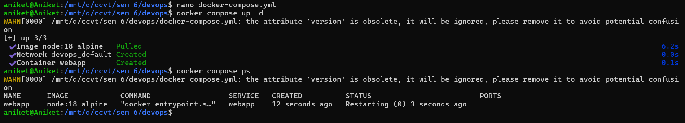
---

#### Problem 2: Volume + Network Configuration

**Given Docker Run Commands:**

```bash
docker network create app-net

docker run -d \
  --name postgres-db \
  --network app-net \
  -e POSTGRES_USER=admin \
  -e POSTGRES_PASSWORD=secret \
  -v pgdata:/var/lib/postgresql/data \
  postgres:15

docker run -d \
  --name backend \
  --network app-net \
  -p 8000:8000 \
  -e DB_HOST=postgres-db \
  -e DB_USER=admin \
  -e DB_PASS=secret \
  python:3.11-slim
```

**Equivalent `docker-compose.yml`:**

```yaml
version: '3.8'

services:
  postgres-db:
    image: postgres:15
    container_name: postgres-db
    environment:
      POSTGRES_USER: admin
      POSTGRES_PASSWORD: secret
    volumes:
      - pgdata:/var/lib/postgresql/data
    networks:
      - app-net

  backend:
    image: python:3.11-slim
    container_name: backend
    ports:
      - "8000:8000"
    environment:
      DB_HOST: postgres-db
      DB_USER: admin
      DB_PASS: secret
    depends_on:
      - postgres-db
    networks:
      - app-net

volumes:
  pgdata:

networks:
  app-net:
```

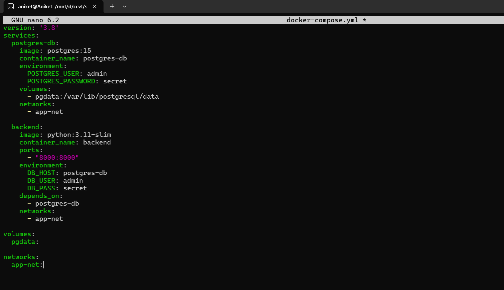

**Verification commands:**

```bash
docker compose up -d
docker compose ps
docker network ls
docker compose down -v
```

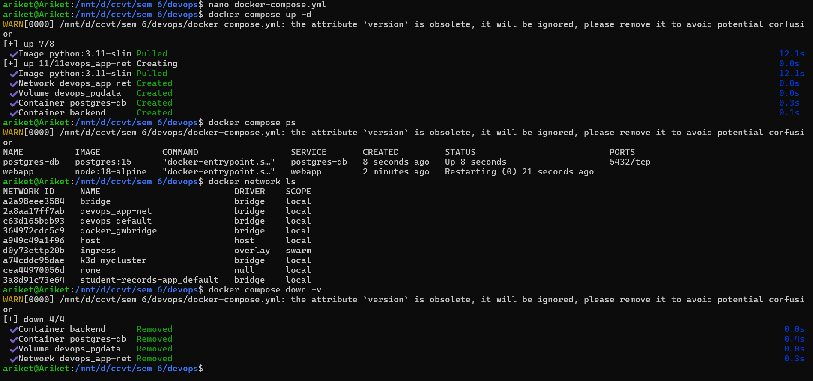

---

### Task 3: Resource Limits Conversion

**Given Docker Run Command:**

```bash
docker run -d \
  --name limited-app \
  -p 9000:9000 \
  --memory="256m" \
  --cpus="0.5" \
  --restart always \
  nginx:alpine
```

**Equivalent `docker-compose.yml`:**

```yaml
version: '3.8'

services:
  limited-app:
    image: nginx:alpine
    container_name: limited-app
    ports:
      - "9000:9000"
    restart: always
    deploy:
      resources:
        limits:
          memory: 256m
          cpus: "0.5"
```

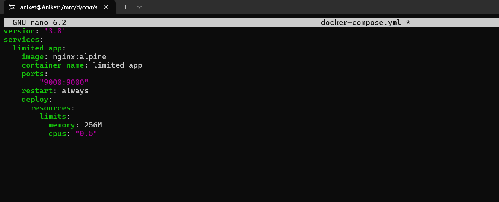
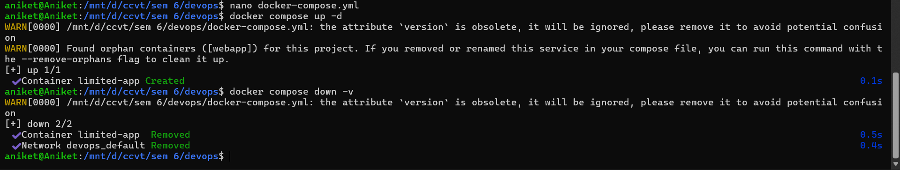

> **Note:** The `deploy` key with resource limits works in Docker Swarm mode. In regular Compose mode, use `mem_limit` and `cpus` at the service level instead.

---

## Part D – Using Dockerfile Instead of Standard Image

### Task 5: Replace Standard Image with Dockerfile (Node App)

Instead of using a prebuilt image directly, create a custom image using a Dockerfile and build it via Docker Compose.

**Step 1: Create `app.js`**

```javascript
const http = require('http');
http.createServer((req, res) => {
  res.end("Docker Compose Build Lab");
}).listen(3000);
```
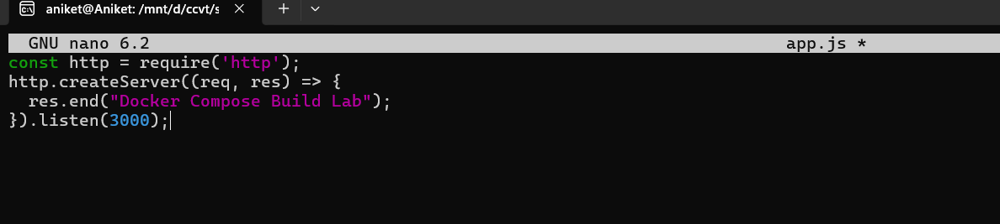

**Step 2: Create `Dockerfile`**

```dockerfile
FROM node:18-alpine
WORKDIR /app
COPY app.js .
EXPOSE 3000
CMD ["node", "app.js"]
```
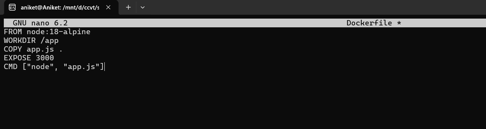

**Step 3: Create `docker-compose.yml`**

```yaml
version: '3.8'

services:
  nodeapp:
    build:
      context: .
      dockerfile: Dockerfile
    container_name: custom-node-app
    ports:
      - "3000:3000"
```
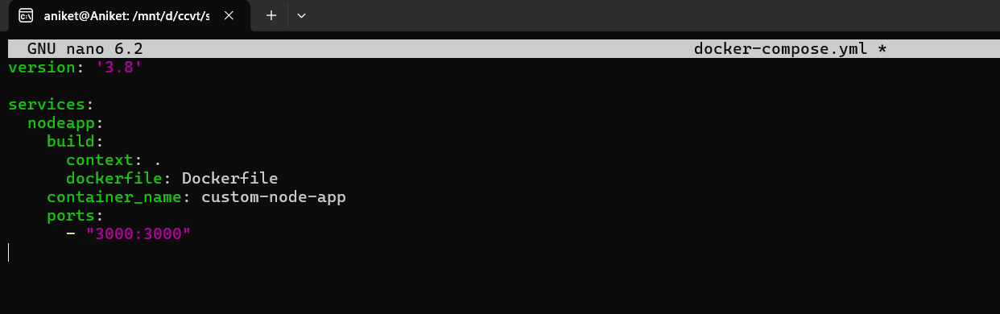

**Build and run:**

```bash
docker compose up --build -d
```
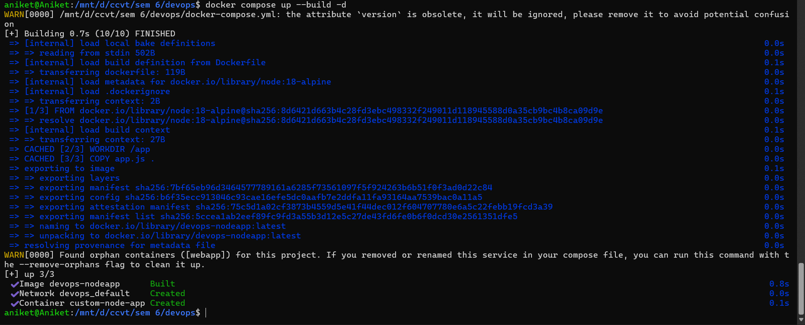

**Access in browser:** `http://localhost:3000`


**Difference between `image:` and `build:`:**

| `image:` | `build:` |
|----------|----------|
| Pulls a prebuilt image from Docker Hub | Builds a custom image from a Dockerfile |
| No local code included | Packages your application code |
| Faster startup | Slower (must build first) |
| Best for standard services | Best for custom apps |

--- 
## Multi-Container Application using Docker Compose

### Objective

To deploy a multi-container application using Docker Compose consisting of:

*   WordPress (frontend)
    
*   MySQL (backend database)
    

Also to understand:

*   Container networking
    
*   Volume persistence
    
*   Service scaling
    

* * *

### Background Theory

Docker Compose is a tool used to define and run multi-container Docker applications using a YAML file. It allows us to configure services, networks, and volumes in a structured way.

In this experiment:

*   WordPress acts as the web application
    
*   MySQL acts as the database
    
*   Both containers communicate using Docker's internal network
    

* * *

### Architecture

    User (Browser)
          ↓
    WordPress Container
          ↓
    MySQL Container
          ↓
    Persistent Volume
    


### Implementation Steps

### Step 1: Create Project Directory

    mkdir wp-compose-lab
    cd wp-compose-lab
    


### Step 2: Create docker-compose.yml

    services:
      db:
        image: mysql:5.7
        restart: always
        environment:
          MYSQL_ROOT_PASSWORD: rootpass
          MYSQL_DATABASE: wordpress
          MYSQL_USER: wpuser
          MYSQL_PASSWORD: wppass
        volumes:
          - db_data:/var/lib/mysql
    
      wordpress:
        image: wordpress:latest
        depends_on:
          - db
        ports:
          - "8085:80"
        restart: always
        environment:
          WORDPRESS_DB_HOST: db:3306
          WORDPRESS_DB_USER: wpuser
          WORDPRESS_DB_PASSWORD: wppass
          WORDPRESS_DB_NAME: wordpress
        volumes:
          - wp_data:/var/www/html
    
    volumes:
      db_data:
      wp_data:
    
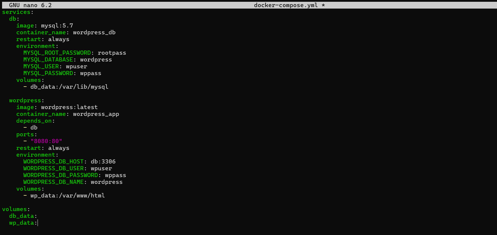

### Step 3: Start Application

    docker compose up -d
    
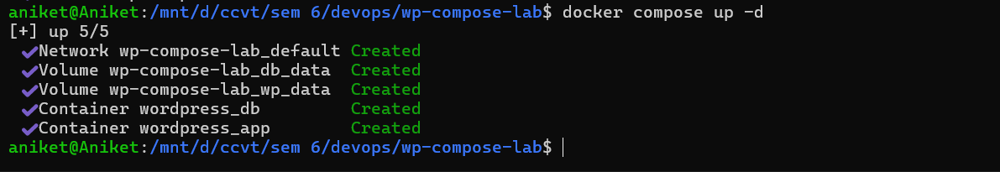

### Step 4: Verify Containers

    docker ps
    

Expected:

*   WordPress container running
    
*   MySQL container running
    
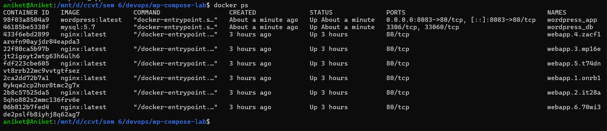

### Step 5: Access Application

Open browser:

    http://localhost:8085
    
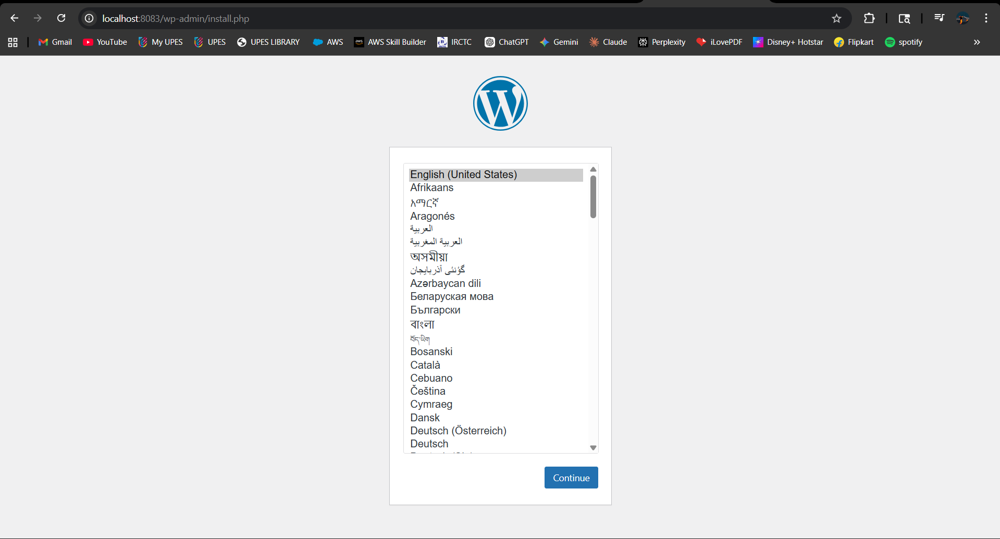

### 🔹 Step 6: Check Volumes

    docker volume ls
    

Expected:

*   db\_data
    
*   wp\_data


---

## Scaling in Docker Compose

Docker Compose supports horizontal scaling of services:

```bash
docker compose up --scale wordpress=3 -d
```

**Terminal Output (observed during lab):**
```
[+] Running 4/4
 ✔ Container wp-compose-lab-db-1          Running   0.0s
 ✔ Container wp-compose-lab-wordpress-1   Running   0.0s
 ✔ Container wp-compose-lab-wordpress-3   Created   0.2s
 ✔ Container wp-compose-lab-wordpress-2   Created   0.2s
Error: Bind for 0.0.0.0:8085 failed: port is already allocated
```

> **Limitation:** All scaled containers try to use the same host port, causing conflicts. A reverse proxy (e.g., Nginx) is required for proper load balancing.


---

## Docker Compose vs Docker Swarm

| Feature | Docker Compose | Docker Swarm |
|---------|---------------|--------------|
| Scope | Single host | Multi-node cluster |
| Scaling | Manual | Built-in |
| Load balancing | No | Yes (internal LB) |
| Self-healing | No | Yes |
| Rolling updates | No | Yes |
| Networking | Basic | Overlay network |

---

## Best Practices for Docker Compose

1. **Use meaningful service names** – Helps with debugging and understanding
2. **Explicit ports** – Always map ports explicitly for clarity
3. **Environment variables** – Use `.env` files for credentials
4. **Volume strategy** – Use named volumes for persistence
5. **Health checks** – Add `healthcheck` directives for critical services
6. **Resource limits** – Set memory and CPU limits to prevent resource hogging
7. **Logging** – Configure logging drivers for centralized log management
8. **Versioning** – Use specific image tags, avoid `latest` in production

---

## Key Takeaways

- `docker run` is ideal for quick testing and single container use
- Docker Compose is essential for managing multi-container applications
- YAML configuration is version-controllable and reproducible
- Understanding the flag-to-YAML mapping helps transition between approaches
- Multi-stage builds create optimized, smaller production images
- Docker Compose has scaling limitations — Docker Swarm or Kubernetes is needed for production-grade orchestration

---
